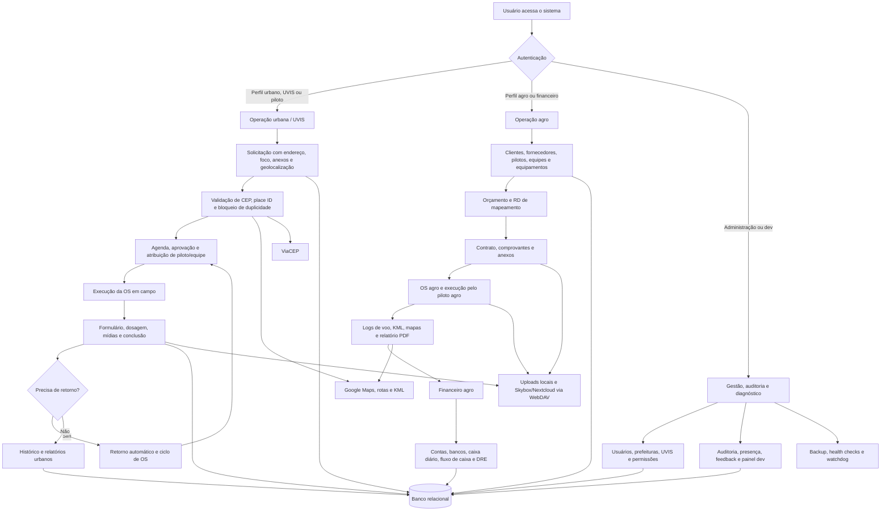

# IJA System

Sistema web desenvolvido para apoiar a gestão operacional de serviços com drones, reunindo em uma única plataforma solicitações, agenda, ordens de serviço, equipes, pilotos, veículos, relatórios, anexos, auditoria e operações agro.

O sistema é utilizado pela **Oceano Azul** e por **UVIS de São Paulo** em rotinas operacionais ligadas ao **combate à dengue** e à gestão de serviços de campo. A aplicação ajuda a organizar demandas, aprovações, deslocamentos, execução, mídias, registros de voo, retornos automáticos e prestação de contas.

O projeto nasceu para resolver uma dor prática: substituir planilhas, mensagens soltas e controles manuais por um ambiente com login, histórico, filtros, permissões por perfil, escopo por prefeitura/região e dados consultáveis.

> Este repositório representa um sistema real, construído e evoluído a partir de demandas operacionais. A documentação abaixo descreve os módulos existentes e as principais decisões técnicas do projeto.

## Documentação do Projeto

A [central de documentação](docs/README.md) reúne os guias e identifica quais documentos são históricos. Para começar:

- [Instalação e primeiro acesso local](docs/desenvolvimento.md)
- [Configuração e variáveis de ambiente](docs/configuracao.md) e [.env.example](.env.example)
- [Arquitetura, dados e permissões](docs/arquitetura.md)
- [Inventário de módulos, modelos e rotas](docs/referencia-codigo.md)
- [Testes e manutenção](docs/testes.md)
- [Deploy, backup, recuperação e diagnóstico](docs/operacao.md)
- [Revisão de 25/09/2026 e pendências técnicas](docs/revisao-documentacao-2026-09-25.md)

## Visão Geral

O IJA System centraliza duas frentes principais:

- **Operação urbana / UVIS**: solicitações de voo, validação por endereço, geolocalização, agendamento, aprovação, execução em campo, retorno automático, checklists, equipes UVIS, pilotos, veículos, mídias e relatórios.
- **Operação agro**: clientes, fornecedores, orçamentos, contratos, ordens de serviço, pilotos agro, equipes, equipamentos, mapeamentos, logs de voo, financeiro, bancos, contas a pagar/receber, caixa diário e banco de talentos.

A aplicação é construída em Flask, com arquitetura modular por domínio, banco relacional via SQLAlchemy, migrações com Alembic/Flask-Migrate, templates Jinja2, exportações em Excel/PDF e integrações externas para mapas, CEP, armazenamento de arquivos e backup.

## Problema Que o Projeto Resolve

Antes de um sistema centralizado, uma operação desse tipo tende a depender de:

- planilhas separadas por área ou responsável;
- troca de arquivos por WhatsApp/e-mail;
- dificuldade para saber o status real de uma solicitação;
- perda de histórico entre aprovação, execução, conclusão e retorno;
- baixa rastreabilidade sobre quem alterou o quê;
- retrabalho na geração de relatórios e documentos;
- dificuldade de filtrar dados por unidade, região, prefeitura, equipe ou piloto;
- risco de falhas em uploads grandes de imagens e vídeos.

O IJA System organiza esse fluxo em uma aplicação única, com dados estruturados e telas voltadas para o trabalho diário.

## Principais Funcionalidades

### Documentação específica

- [Retorno automático em ordens de serviço](docs/README-retorno-automatico.md)
- [Central de retornos automáticos](docs/relatorio-central-retornos-automaticos.md)
- [Upload em streaming com WebDAV/Skybox](docs/relatorio-upload-stream-webdav.md)
- [Filtro de endereço no painel de gestão](docs/manuais-operacionais/painel-gestao-filtro-endereco-notion.md)
- [Banco de talentos agro](docs/manuais-operacionais/banco-talentos-agro-notion.md)
- [Alertas de limpeza de veículos](docs/manuais-operacionais/alertas-limpeza-veiculos-oceano-azul-notion.md)
- [Supervisor Operacional de Veículos: apresentação e guia de uso](docs/perfil-supervisor-operacional-veiculos.md)
- [Portal do Cidadão e triagem de denúncias](docs/manuais-operacionais/portal-cidadao-triagem.md)
- [Sessões, senhas e proteção CSRF](docs/seguranca-sessoes-senhas.md)

### Autenticação e Perfis de Acesso

O sistema possui login com redirecionamento conforme o perfil do usuário. Entre os perfis tratados no código estão:

- desenvolvedor;
- administrador;
- diretor;
- administrador de prefeitura;
- regional;
- COVISA;
- UVIS;
- equipe operacional da UVIS;
- piloto;
- equipe operacional;
- supervisor operacional de veículos;
- financeiro;
- financeiro admin;
- piloto agro.

O projeto combina perfil, indicadores de atuação e escopos por prefeitura, região, UVIS e equipe. As regras variam por módulo; consulte a [referência de permissões e suas limitações](docs/arquitetura.md). Sessões com timeout, política de senha e CSRF possuem ativação opcional por ambiente.

### Painéis Operacionais e Administrativos

O sistema possui painéis especializados para administração, direção, UVIS, equipes e pilotos. Eles permitem:

- acompanhar solicitações recebidas;
- filtrar por status, período, endereço, UVIS, região, prefeitura, equipe e piloto;
- aprovar, atualizar, cancelar e consultar demandas;
- administrar UVIS, prefeituras, usuários, equipes e credenciais;
- visualizar OS em andamento e histórico;
- consultar formulários preenchidos pelas equipes;
- acessar métricas operacionais e contexto local;
- exportar dados em planilhas e documentos.

### Fluxo UVIS e Equipe Operacional

As UVIS podem registrar demandas e acompanhar o andamento das solicitações. O sistema também contempla acesso operacional para equipes da UVIS, com foco em execução, consulta e registro de campo.

Recursos importantes desse fluxo:

- cadastro de solicitações com endereço, data, foco, tipo de operação e anexos;
- consulta de CEP e preenchimento de endereço;
- geolocalização, place ID e integração com Google Maps;
- bloqueio preventivo de solicitações duplicadas por local quando aplicável;
- atribuição de equipe UVIS à solicitação;
- visualização de agenda;
- acompanhamento de status;
- formulários de execução;
- histórico de solicitações e OS;
- retorno automático quando aplicável.

### Retorno Automático

O fluxo de retorno automático organiza ciclos de OS que precisam de nova visita ou nova etapa operacional. A visualização do ciclo mostra:

- OS inicial;
- OSs geradas como retorno;
- etapas encadeadas no mesmo ciclo;
- status, agendamento, execução, situação, larva e mídias;
- filtros para localizar retornos automáticos, OSs que geraram retorno ou ciclos completos.

A lógica fica centralizada em `app/shared/retorno_ciclo.py` e os filtros de histórico em `app/shared/os_history_filters.py`.

### Portal do Cidadão e Triagem

O portal público recebe ocorrências com endereço, identificação, consentimento e até cinco anexos, gerando protocolo. A triagem central encaminha a denúncia para coordenadoria e UVIS; a UVIS pode convertê-la em solicitação operacional, que segue as validações do fluxo urbano.

O portal também apresenta notícias e boletim a partir de fontes externas, incluindo InfoDengue, com filtros de doença e ano. A disponibilidade depende do provedor e da configuração municipal. Consulte o [manual do portal e da triagem](docs/manuais-operacionais/portal-cidadao-triagem.md).

### Agenda e Notificações

O módulo de agenda organiza operações por período e perfil de usuário. Ele possui visões específicas para piloto, equipe, UVIS e administração.

Funcionalidades presentes:

- agenda operacional;
- filtros por período;
- exportação em Excel;
- notificações internas;
- marcação de notificações como lidas;
- limpeza e exclusão de notificações;
- rotas do dia para apoio ao deslocamento.

### Pilotos, OS e Execução em Campo

O sistema inclui área voltada para pilotos e equipes que executam ordens de serviço.

Entre os recursos implementados:

- fila de OS por piloto ou equipe;
- histórico de OS;
- conclusão de serviços;
- formulário operacional de execução;
- cálculos de dosagem;
- upload de imagem principal, imagens complementares e vídeos;
- upload em streaming e upload em segundo plano por chunks;
- exclusão controlada de mídias;
- exportação de OS em PDF e Excel;
- visualização de mapas e trajetos quando há coordenadas.

### Upload de Mídias e Armazenamento Externo

Um dos pontos técnicos relevantes do projeto é o tratamento de upload de mídias pesadas.

O sistema possui suporte para:

- upload em streaming;
- envio de imagens e vídeos por chunks;
- sessões de upload em segundo plano;
- acompanhamento de status de upload;
- armazenamento externo via WebDAV/Skybox/Nextcloud;
- remoção de arquivos remotos quando mídias são apagadas no sistema;
- anexos vinculados a solicitações, comentários de feedback, orçamentos, contratos, OS agro e registros de veículo.

Essa solução reduz o risco de timeout em servidores Gunicorn e evita carregar arquivos grandes inteiros na memória da aplicação.

### Módulo Agro

O módulo agro amplia o sistema para uma operação comercial, operacional e financeira de drones no campo.

Ele contempla:

- dashboard agro;
- cadastro de clientes agro;
- cadastro de fornecedores;
- cadastro de equipes;
- cadastro de pilotos agro;
- cadastro de equipamentos agro;
- orçamentos;
- templates de orçamento e contrato;
- contratos;
- comprovantes de pagamento;
- ordens de serviço agro;
- relatório de OS agro em PDF;
- mapeamentos e RD de mapeamento;
- logs de voo agro por Excel e KML;
- vínculo de rotas KML com OS agro;
- acesso específico para piloto agro.

O fluxo permite sair de um cadastro comercial, gerar orçamento, transformar em contrato, criar OS, acompanhar a execução e alimentar o financeiro.

### Financeiro Agro

O projeto possui uma área financeira voltada ao contexto agro, com separação entre entradas, saídas, contas, bancos e relatórios.

Recursos presentes:

- lançamentos financeiros;
- entradas e saídas manuais;
- contas a pagar;
- contas a receber;
- categorias e subcategorias;
- bancos e conciliação;
- caixa diário com abertura e fechamento;
- controle por competência;
- dashboard financeiro;
- fluxo de caixa;
- DRE gerencial;
- relatório geral de contas;
- exportação em Excel e PDF;
- recebimento financeiro de OS concluída.

### Banco de Talentos Agro

O sistema possui um banco de talentos para organizar currículos e candidatos relacionados à operação agro.

Esse módulo inclui:

- upload de currículo;
- armazenamento de metadados do arquivo;
- listagem de candidatos;
- detalhe do talento;
- download e visualização do PDF;
- organização por prefeitura quando aplicável.

### Veículos, Equipamentos e Checklists

O sistema controla recursos operacionais usados em campo.

Funcionalidades:

- cadastro de veículos;
- cadastro de drones e baterias;
- controle de equipamentos;
- logs de veículo;
- controle de quilometragem;
- abertura e encerramento de turno;
- abastecimentos por turno;
- upload de nota fiscal e foto de painel;
- alertas e ciência de limpeza de veículos;
- checklist semanal de veículo;
- checklist semanal de drone;
- painel administrativo de checklists semanais;
- exportação de veículos e logs em Excel.

O supervisor pode receber um veículo diretamente pela listagem. Para abastecimento do tipo Veículo, há trava de até 500 km acima da referência anterior, com regras detalhadas no [manual do supervisor](docs/perfil-supervisor-operacional-veiculos.md). A tela de rastreamento usa tabelas de posições, histórico e alertas associadas à RedGPS; o sincronizador que obtém leituras externas não foi localizado neste repositório.

### Importação de Dados DJI e KML

O projeto possui módulo para importar e analisar dados vindos de voos DJI.

Recursos identificados:

- importação de planilhas `.xlsx`;
- deduplicação por fingerprint;
- armazenamento de lotes de importação;
- registros de voo com piloto, equipe, drone, período, área pulverizada, duração e bateria;
- importação de rotas KML;
- visualização de rota em mapa;
- vínculo manual ou assistido entre KML e OS;
- download e exclusão controlada de KML;
- relatórios de logs DJI;
- fluxo equivalente para logs agro.

### Relatórios e Exportações

O sistema oferece várias formas de extrair dados para análise ou prestação de contas.

Formatos e exemplos:

- Excel com OpenPyXL/Pandas;
- PDF com ReportLab, WeasyPrint e Pypdf;
- relatórios de solicitações;
- relatórios de OS;
- relatórios de coleta de imagens;
- relatórios de retornos automáticos;
- relatórios financeiros agro;
- exportação de agenda;
- exportação de histórico;
- documentos de orçamento, contrato e OS agro.

### Feedback, Suporte e Melhoria Contínua

O sistema possui uma central de feedback para registrar sugestões, problemas e melhorias.

Recursos presentes:

- criação de tópicos por unidade ou usuário autorizado;
- categorias, prioridade e status;
- roteamento de suporte;
- comentários internos ou visíveis conforme o fluxo;
- anexos em comentários;
- acompanhamento de resolução.

### Auditoria, Diagnóstico e Observabilidade

O projeto possui mecanismos internos para registrar atividade e diagnosticar problemas.

Recursos técnicos:

- auditoria automática de requisições mutáveis (`POST`, `PUT`, `PATCH`, `DELETE`) selecionadas por palavras-chave de ação, com exclusões;
- registro de usuário, método, endpoint, path, status code, IP, user agent e horário;
- presença de usuários autenticados;
- painel dev com métricas de erros, usuários ativos, checks de ambiente e runtime;
- health checks simples e completos;
- registro de eventos de watchdog/redeploy;
- tratamento padronizado para erros 404 e 500 em HTML ou JSON.

## Fluxograma Geral



## Arquitetura

O projeto segue o padrão de aplicação Flask com factory (`create_app`) e separação por módulos de domínio.

```text
app/
  __init__.py              # Factory, extensões, auditoria, presença e health checks
  routes.py                # Registro central dos módulos
  models.py                # Modelos SQLAlchemy
  extensions.py            # SQLAlchemy, LoginManager e Migrate
  clients/                 # Clientes externos: CEP e Google Maps
  core/                    # Rotas, erros e helpers globais
  shared/                  # Validadores, filtros, upload, acesso, mapas e formatadores
  modules/
    admin_checklists/
    admin_dashboard/
    admin_uvis/
    agro/
    agenda_notificacoes/
    anexos/
    auditoria/
    auth/
    backup/
    canceladas/
    cep/
    chatbot/
    clientes/
    dashboard/
    denuncias/
    dev_dashboard/
    dji_flight_logs/
    drones_import/
    equipamentos/
    equipe_uvis_dashboard/
    equipes/
    estoque/
    feedback/
    mapas/
    painel_operacional/
    piloto_checklists/
    piloto_os/
    pilotos/
    portal_cidadao/
    relatorios/
    solicitacoes/
    usuarios/
    uvis_equipes/
    veiculos/
  static/
  templates/
migrations/
scripts/
tests/
```

## Modelagem de Dados

O banco possui entidades para diferentes áreas do sistema. Alguns grupos importantes:

- **Usuários e acesso**: `Usuario`, `Prefeitura`, vínculos por perfil, prefeitura, região, piloto agro e equipe UVIS.
- **Operação UVIS**: `Solicitacao`, `OrdemServico`, `OrdemServicoEquipeUvis`, `Notificacao`.
- **Participação cidadã**: `Denuncia`, `DenunciaAnexo`, vínculos de triagem e conversão em solicitação.
- **Equipes e pilotos urbanos**: `Pilotos`, `PilotoUvis`, `Equipe`, `EquipePiloto`, `EquipeUvis`.
- **Agro comercial e operacional**: `ClienteAgro`, `FornecedorAgro`, `OrcamentoAgro`, `ContratoAgro`, `RdMapeamentoAgro`, `OrdemServicoAgro`, `EquipeAgro`, `PilotoAgro`, `EquipamentoAgro`.
- **Financeiro agro**: `FinanceiroAgro`, `FinanceiroAgroEntrada`, `FinanceiroAgroSaida`, `FinanceiroAgroCategoria`, `FinanceiroAgroSubcategoria`, `BancoAgro`, `FinanceiroAgroCaixaDiario`, `FinanceiroAgroCompetenciaControle`.
- **Banco de talentos agro**: `CurriculoAgro`.
- **Equipamentos e frota**: `Equipamentos`, `Drones`, `Baterias`, `Veiculos`, `LogVeiculo`, `Abastecimento`, `LimpezaVeiculo`, `LimpezaVeiculoAlertaCiencia`, `ChecklistSemanalVeiculo`, `ChecklistSemanalDrone`.
- **Manutenção e estoque**: `EstoquePeca`, `ManutencaoEquipamento`, `ManutencaoPecaUso`.
- **Rastreamento**: `RastreamentoPosicao`, `RastreamentoHistorico`, `RastreamentoAlerta`.
- **DJI urbano**: `DjiFlightLogImport`, `DjiFlightRecord`, `DjiFlightKmlRoute`.
- **Logs agro**: `AgroFlightLogImport`, `AgroFlightRecord`, `AgroFlightKmlRoute`.
- **Governança**: `AuditoriaUsuario`, `UsuarioPresenca`, `FeedbackTopico`, `FeedbackComentario`, `FeedbackComentarioAnexo`, `WatchdogDeployEvent`.

## Integrações

O projeto integra ou prepara integração com:

- **Google Maps**: mapas, geocodificação, rotas, visualização geográfica e KML;
- **Correios, ViaCEP e BrasilAPI**: consulta de endereço por CEP, conforme configuração e fallback;
- **Skybox/Nextcloud via WebDAV**: armazenamento de mídias de OS e arquivos operacionais;
- **Dropbox**: rotina de backup e currículos do banco de talentos;
- **Gemini**: processamento de currículos e importação assistida de drones;
- **InfoDengue, feeds de saúde e clima**: conteúdo público e contexto operacional;
- **RedGPS**: apresentação de posições persistidas; ingestão externa a confirmar;
- **PostgreSQL**: banco de produção via `DATABASE_URL`;
- **SQLite em testes / PostgreSQL local**: SQLite temporário cobre regras; migrações completas exigem validação em PostgreSQL;
- **Gunicorn**: execução em produção;
- **Flask-Migrate/Alembic**: versionamento de schema.

## Stack Técnica

- Python
- Flask
- Flask-Login
- Flask-SQLAlchemy
- Flask-Migrate / Alembic
- Jinja2
- SQLAlchemy
- PostgreSQL
- OpenPyXL
- Pandas
- ReportLab
- WeasyPrint
- Pypdf
- Requests / HTTPX
- APScheduler
- Dropbox SDK
- WhiteNoise
- Flask-Talisman
- Gunicorn
- HTML, CSS e JavaScript

## Qualidade e Testes

O repositório possui testes automatizados cobrindo regras específicas de negócio, acesso e integração entre módulos, como:

- filtros da agenda operacional;
- escopo operacional de veículos;
- acesso ao painel dev;
- banco de talentos agro;
- upload de comprovante agro para Skybox;
- vínculo automático de KML com OS;
- bloqueio de solicitação por place ID;
- retorno automático e escopos por prefeitura;
- filtros regionais/equipe em relatórios.

Com o ambiente virtual ativado, execute na raiz:

```bash
DATABASE_URL=sqlite:///:memory: python -m pytest -q
node --test tests/session_security_browser.test.cjs tests/csrf_security_browser.test.cjs
python scripts/build_css_bundle.py --check
python scripts/build_docs_inventory.py --check
```

Na revisão de 25/09/2026, passaram 229 testes Python, 36 subtestes e 25 testes JavaScript. Os testes usam dados temporários e simulações; não comprovam funcionamento das integrações em produção. Veja [testes e manutenção](docs/testes.md) para cobertura e aceite manual.

## Como Rodar Localmente

### 1. Clonar o repositório

```bash
git clone https://github.com/IJA-Drones/Ija-System.git
cd Ija-System
```

### 2. Criar e ativar ambiente virtual

Windows:

```bash
python -m venv .venv
.venv\Scripts\activate
```

Linux/macOS:

```bash
python -m venv .venv
source .venv/bin/activate
```

### 3. Instalar dependências

```bash
python -m pip install -r requirements.txt
```

### 4. Configurar variáveis de ambiente

Copie [.env.example](.env.example) para `.env` apenas se o arquivo ainda não existir. Configure `DATABASE_URL` para um PostgreSQL local exclusivo e preencha `SECRET_KEY` com uma chave gerada:

```bash
python -c "import secrets; print(secrets.token_hex(32))"
```

Não há banco padrão nem credencial inicial. O [guia de desenvolvimento](docs/desenvolvimento.md) detalha dependências, configuração, preparação do banco e criação do primeiro administrador local. As integrações e flags opcionais estão no [catálogo de configuração](docs/configuracao.md).

### 5. Aplicar migrações

Depois de conferir o banco de destino e as observações de instalação do [guia de desenvolvimento](docs/desenvolvimento.md):

```bash
flask --app app:create_app db upgrade
```

### 6. Rodar a aplicação

```bash
python run.py
```

Por padrão, o ambiente local mantém o modo de depuração ativo, mas desativa o
reloader do Flask para evitar que toda a aplicação seja carregada duas vezes.
Alterações em CSS e JavaScript continuam aparecendo ao atualizar o navegador.
Para reativar o reload automático de arquivos Python, use:

```bash
FLASK_USE_RELOADER=1 python run.py
```

O `run.py` também mantém `app/static/css/style.bundle.css` sincronizado com os
arquivos componentizados durante o desenvolvimento. Para gerar ou validar o
bundle manualmente:

```bash
python scripts/build_css_bundle.py
python scripts/build_css_bundle.py --check
```

A aplicação sobe em:

```text
http://localhost:5002
```

## Deploy

O [Procfile](Procfile) constrói o bundle CSS, aplica migrações e inicia Gunicorn. A migração é incondicional no comando atual. Parâmetros de workers, threads e timeout estão descritos em [configuração](docs/configuracao.md).

Também existem endpoints de saúde:

```text
/healthz
/healthz/full
```

O primeiro verifica a resposta do processo. O segundo executa `SELECT 1` no banco e retorna 503 em erro SQL; não valida todo o schema ou as integrações. Veja o [guia de operação](docs/operacao.md) para publicação, limitações do backup, restauração e diagnóstico.

## O Que Este Projeto Demonstra

Para além das telas, este projeto demonstra experiência prática com:

- organização de um sistema Flask modular;
- modelagem relacional para um domínio com muitos fluxos;
- controle de permissão por perfil, prefeitura, região, UVIS e equipe;
- formulários complexos com validação;
- geração de documentos PDF e planilhas Excel;
- integração com APIs externas;
- tratamento de upload pesado;
- auditoria e rastreabilidade;
- manutenção de migrations ao longo da evolução do produto;
- desenvolvimento de funcionalidades a partir de necessidades reais de operação.

## Nota de Portfólio

Este não é um projeto de estudo isolado. É um sistema operacional em evolução, utilizado em um contexto real pela Oceano Azul e por UVIS de São Paulo no apoio a rotinas de combate à dengue, com funcionalidades criadas para resolver problemas concretos de organização, rastreabilidade e produtividade.

Ao mesmo tempo, ele ainda carrega características naturais de um produto interno em crescimento: alguns módulos cresceram bastante, há pontos que podem ser refinados e a arquitetura continua evoluindo conforme novas demandas aparecem. Essa também é parte importante do aprendizado técnico do projeto.

## Autor

Desenvolvido por Pedro Cruz e João Pedro, com foco em sistemas web, automação de processos operacionais, gestão de dados e ferramentas internas para equipes de campo.
