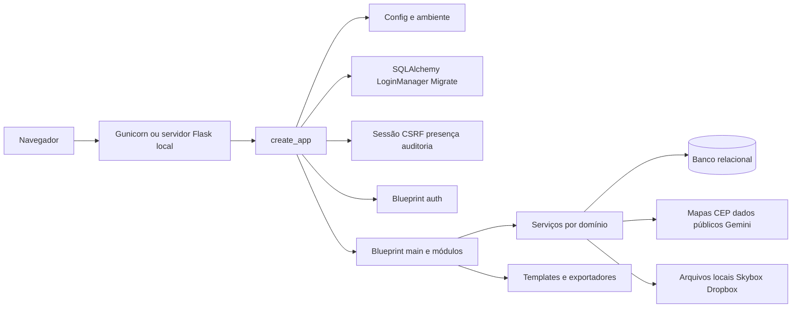
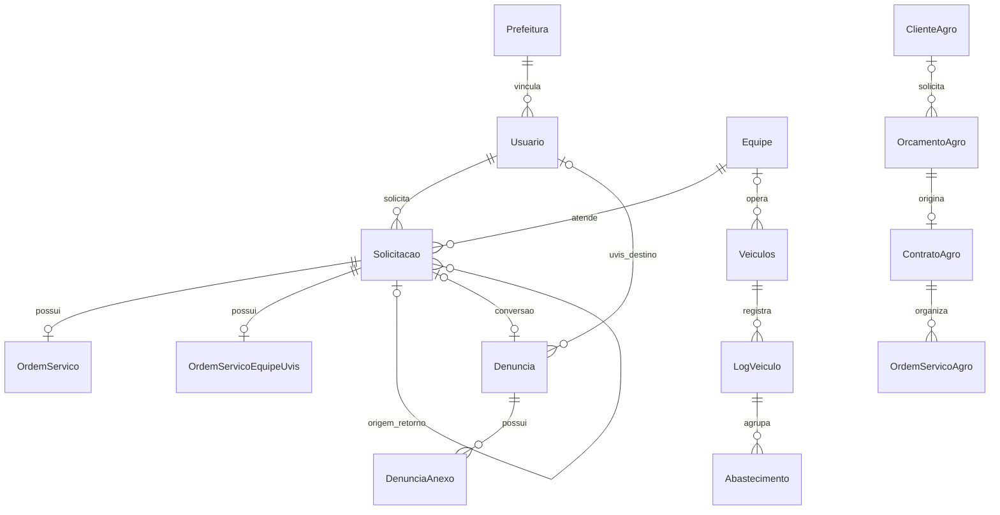

# Arquitetura, dados e permissões

O IJA System é uma aplicação Flask modular, com renderização Jinja2, JavaScript próprio, banco relacional e integrações HTTP. A aplicação e a maioria dos trabalhos em segundo plano compartilham o processo web. Esta descrição corresponde ao código revisado em 25/09/2026; a [referência gerada](referencia-codigo.md) contém os 34 módulos, 60 modelos e 348 declarações de rotas encontrados nessa revisão.

## Inicialização e requisições

- [app/__init__.py](../app/__init__.py): factory, extensões, Talisman, WhiteNoise, hooks, health checks e erros globais.
- [app/routes.py](../app/routes.py): cria `main` e chama `register_routes(bp)` dos domínios. Os módulos de domínio não são todos blueprints independentes.
- [auth/routes.py](../app/modules/auth/routes.py): blueprint `auth`, com três logins e logout.
- [session_security.py](../app/shared/session_security.py): blueprint `session_security` e renovação/consulta da sessão.
- `app/modules/*/routes.py`: entradas HTTP e validações de acesso; `service.py`: regras, consultas e gravações; `exporters.py`/`excel_exporters.py`: documentos.
- [app/models.py](../app/models.py): modelos centrais. [app/extensions.py](../app/extensions.py) permite compartilhar extensões sem criar a aplicação na importação.

A auditoria automática cobre métodos de escrita que também correspondem às palavras-chave de ação em `_should_audit_request`. Há exclusões por endpoint/caminho. Ela registra metadados da requisição, não um histórico universal de antes/depois das entidades. A retenção é por quantidade. Presença e sessão possuem finalidades e prazos distintos.

## Mapa de domínios

| Domínio | Módulos | Responsabilidade |
| --- | --- | --- |
| Acesso e cadastros institucionais | `auth`, `usuarios`, `admin_uvis` | Login, usuários, prefeituras e UVIS. |
| Planejamento urbano | `solicitacoes`, `dashboard`, `admin_dashboard`, `canceladas`, `agenda_notificacoes` | Demanda, análise, agendamento, status, notificações e cancelamentos. |
| Operação de campo | `piloto_os`, `equipe_uvis_dashboard`, `uvis_equipes`, `pilotos`, `equipes`, `piloto_checklists`, `admin_checklists` | Distribuição e execução de OS, equipe UVIS, mídias, dosagem, checklists e histórico. |
| Recursos e logística | `veiculos`, `equipamentos`, `estoque`, `drones_import` | Frota, turnos, abastecimento, limpeza, rastreamento, manutenção, peças e importação. |
| Informação operacional | `relatorios`, `dji_flight_logs`, `mapas`, `painel_operacional`, `cep`, `anexos` | Consultas, geocodificação, KML, mapas, arquivos e exportações. |
| Cidadão e triagem | `portal_cidadao`, `denuncias` | Recebimento público, protocolo, triagem, encaminhamento e conversão em solicitação. |
| Agro e clientes | `agro`, `clientes` | Cadastros, orçamento, contrato, OS, voo, financeiro e talentos; clientes urbanos têm módulo próprio. |
| Suporte e operação técnica | `feedback`, `chatbot`, `auditoria`, `dev_dashboard`, `backup` | Bugs, FAQ, rastreabilidade, diagnóstico, eventos e backup. |

## Relações centrais de dados

O diagrama resume vínculos; as constraints exatas e os campos opcionais estão em `models.py` e nas migrações. A [referência](referencia-codigo.md) lista todos os campos declarados diretamente e as chaves estrangeiras de cada modelo, incluindo financeiro, KML e checklists.

Pontos de modelagem que precisam ser preservados em alterações:

- `Solicitacao` é a demanda. `OrdemServico` registra execução urbana; `OrdemServicoEquipeUvis` registra o formulário da equipe UVIS. Não são a mesma tabela.
- O retorno usa uma nova solicitação com vínculo à origem. [retorno_ciclo.py](../app/shared/retorno_ciclo.py) organiza a cadeia para apresentação; filtros comuns ficam em [os_history_filters.py](../app/shared/os_history_filters.py).
- `Equipamentos` é a base de herança de `Drones`, `Baterias` e `Veiculos`. `EquipamentoAgro` é um modelo separado.
- `Usuario.equipe_uvis_uvis_usuario_id` vincula a conta operacional à UVIS dona. `EquipeUvis` representa membros; a equipe urbana Oceano utiliza `Equipe` e seus vínculos com pilotos.
- `FinanceiroAgro` está ligado ao fluxo comercial; entradas/saídas manuais, categorias, bancos, caixa e controle de competência usam tabelas próprias. Alterações financeiras devem considerar todos esses fluxos.
- `DjiFlight*` e `AgroFlight*` são famílias separadas para importações, registros e rotas. Os arquivos KML ficam fora do banco, com caminho e metadados persistidos.
- Rastreamento utiliza `RastreamentoPosicao`, `RastreamentoHistorico` e `RastreamentoAlerta`. O serviço apresenta leituras existentes; um sincronizador RedGPS não foi localizado no repositório.

## Perfis e escopos

As permissões resultam da combinação de tipo de usuário, flags, vínculos e filtros aplicados por cada módulo. O menu visível não é a autoridade de segurança. Fontes principais: [access.py](../app/shared/access.py), [auth/service.py](../app/modules/auth/service.py), [vehicle_supervisor.py](../app/shared/vehicle_supervisor.py) e serviços de cada domínio.

| Perfil ou condição | Comportamento observado |
| --- | --- |
| `dev`, `diretor`, `admin` | Administradores globais no helper de escopo municipal. Apenas `dev` acessa diagnóstico e backup pela interface. |
| `prefeitura_admin` | Administração municipal; helper comum bloqueia consulta quando não há prefeitura configurada. |
| `regional` | Consultas regionais usam região normalizada. Ausência de região bloqueia o helper regional. |
| `covisa` | Triagem central das denúncias. O legado `visualizar` com região `COVISA` também é reconhecido para esse fluxo. |
| `uvis`, `equipe_uvis` | Acesso à demanda/unidade ou equipe vinculada, com regras específicas para formulário operacional e mídias. |
| `piloto`, `equipe_oceano` | Operação urbana conforme vínculos com piloto/equipe. |
| `sup_veiculos` | Supervisor operacional; atribuição direta ao veículo e equipe desse veículo em fluxos de OS. Alguns helpers reconhecem também o alias `sup_veiculo`, mas as listas de módulos não são uniformes; use o identificador cadastrado pela tela. |
| `operario`, `visualizar`, `visualizador`, `operador` | Valores presentes em listas diferentes de módulos. Não são aliases universais; consultar o guard da ação. |
| `financeiro`, `financeiro_admin` | Acesso financeiro agro depende também de `trabalha_agro`; configurações financeiras possuem regra mais restrita. |
| `piloto_agro` | Login exclusivo e vínculo obrigatório a piloto agro ativo. |
| `trabalha_agro` | Exigida pelo helper de acesso ao painel agro inclusive para administradores. |
| `trabalha_oceano_azul`, `suporte_operacional`, `suporte_tecnico` | Indicadores usados nos fluxos específicos, não concessão global de acesso. |

O helper comum `apply_prefeitura_scope` deixa consultas de administradores globais sem filtro municipal. Para `prefeitura_admin` e supervisor sem prefeitura ele nega o resultado; para outros perfis sem prefeitura pode retornar a consulta sem filtro. Além disso, existem consultas específicas da frota com comportamento próprio. Portanto, não há garantia automática de isolamento apenas por existir uma coluna `prefeitura_id`. Toda nova consulta, download e exportação precisa aplicar a regra do domínio e ser verificada com usuários de municípios diferentes.

## Arquivos, tarefas e frontend

Uploads locais ficam em `upload-files/`. Caminhos com `skybox://` e `webdav://` identificam armazenamento remoto. O banco mantém referências, não uma cópia completa dos arquivos. Um backup SQL não restaura sozinho esses arquivos nem os currículos no Dropbox.

Vídeos usam `ThreadPoolExecutor`, metadados em memória e arquivos temporários; PDFs de coleta usam jobs em memória. O backup utiliza APScheduler e thread daemon. Não há fila externa durável implementada. Reinícios e múltiplos workers exigem atenção a jobs interrompidos, estado não compartilhado e execuções duplicadas do scheduler. Veja o [guia de operação](operacao.md).

O frontend usa templates server-side, CSS componentizado com bundle gerado e JavaScript próprio para sessão, CSRF, portal e rastreamento. O service worker atual encaminha requisições à rede; não implementa sincronização de formulários nem funcionamento offline completo.

## Interfaces HTTP

O [catálogo de rotas](referencia-codigo.md) identifica método, caminho, endpoint e arquivo. A aplicação mistura HTML, JSON, multipart e downloads. Não foi encontrado contrato OpenAPI versionado ou autenticação geral por token para integrações externas.

| Interface | Contrato observado |
| --- | --- |
| `GET /healthz` | Texto `ok` e HTTP 200; verifica resposta do processo. |
| `GET /healthz/full` | JSON `status`, `service`, `checks.database`; executa `SELECT 1`; erro SQL retorna 503. Não verifica todas as tabelas. |
| `POST /portal-cidadao/denuncias` | Formulário multipart, arquivos no campo `midias`; sucesso 201 com `success`, `protocolo`, `denuncia_id`, `message`; validação 400 com `errors`. |
| `GET /portal-cidadao/cep/<cep>` | JSON `ok` e endereço; erros 400/404/502 conforme entrada, ausência ou falha do provedor. |
| `POST /portal-cidadao/reverse-geocode` | JSON com latitude/longitude como strings no handler atual; sucesso `ok` e endereço; erros 400/404/502. |
| `POST /api/watchdog/deploy-events` | JSON e segredo `X-Watchdog-Token` ou Bearer; comparação com `WATCHDOG_EVENT_TOKEN`; não usa login de navegador como credencial do watchdog. |
| Rotas autenticadas | Sessão Flask-Login; quando CSRF estiver ativo, token no formulário ou cabeçalho `X-CSRFToken`/`X-CSRF-Token`. |

Formatos de erro variam entre módulos. Não assumir que toda falha terá o mesmo envelope JSON ou que um inventário de rotas autoriza seu consumo por terceiros.
