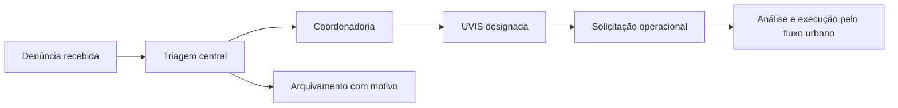

# Portal do Cidadão e triagem de denúncias

Manual do fluxo implementado em 25/09/2026. O cidadão registra uma ocorrência e recebe um protocolo. A equipe responsável faz a triagem, encaminha à coordenadoria e à UVIS, que pode gerar uma solicitação operacional. A denúncia não gera automaticamente uma OS nem uma aprovação de voo.

## Registro pelo cidadão

1. Abra `/portal-cidadao`, sem precisar de login.
2. Escolha o tipo de ocorrência e o foco. No tipo Aedes, informe também o tipo de local.
3. Informe endereço, número, bairro e cidade; confira os dados retornados pelo CEP ou pela localização. Acrescente descrição e complemento quando necessário.
4. Preencha nome, CPF, RG e telefone com DDD. Esses campos são obrigatórios no fluxo atual; não se trata de uma denúncia anônima.
5. Se necessário, anexe até **cinco arquivos**. O backend admite imagens `png`, `jpg`, `jpeg`, `jfif`, `webp`, `heic` e vídeos `mp4`, `mov`, `avi`, `mkv`, `webm`.
6. Confirme o uso das informações para triagem e envie.
7. Guarde o protocolo apresentado após a confirmação do servidor.

Falhas de validação retornam mensagens por campo. Se não houver confirmação, não considere o registro concluído. Não foi identificada uma página pública de consulta do andamento por protocolo; o acompanhamento e a triagem ficam nas telas autenticadas.

O serviço valida a quantidade e a extensão de arquivos, mas não há limite de tamanho por arquivo explícito nesse fluxo. Os limites de infraestrutura e a validação de conteúdo precisam ser homologados pela operação. O manual não estabelece um limite que o servidor ainda não aplica.

## Triagem e encaminhamento

| Responsável | Tela | Ação |
| --- | --- | --- |
| COVISA ou administração global | `/denuncias` | Consultar, abrir detalhe, encaminhar à coordenadoria e arquivar com motivo conforme a ação permitida. |
| Regional | `/coordenadoria/denuncias` | Consultar sua coordenadoria e designar uma UVIS da mesma região. |
| UVIS | `/uvis/denuncias` | Consultar denúncias atribuídas à própria conta e criar a solicitação pelo formulário. |

Os perfis centrais reconhecidos são `covisa`, `dev`, `diretor` e `admin`; o legado `visualizar` com região `COVISA` também é reconhecido. A prefeitura administradora não é automaticamente um perfil de triagem central. O backend verifica o escopo dos detalhes e anexos; a região da UVIS escolhida deve coincidir com a coordenadoria da denúncia.

Ao converter, confira os dados pré-preenchidos e complete o agendamento e os demais campos exigidos pela solicitação. A criação segue as validações do cadastro urbano. A denúncia guarda `solicitacao_id` e passa para `CONVERTIDA_SOLICITACAO`; o handler impede repetir a conversão quando esse vínculo já existe.

## Estados registrados

| Estado | Significado |
| --- | --- |
| `RECEBIDA` | Registro criado pelo portal. |
| `EM_TRIAGEM_COVISA` | Estado previsto no modelo e considerado nas filas de triagem; não implica uma etapa automática ao abrir o detalhe. |
| `ENCAMINHADA_COORDENADORIA` | Encaminhamento regional registrado. |
| `ENCAMINHADA_UVIS` | UVIS designada. |
| `CONVERTIDA_SOLICITACAO` | Vínculo com solicitação operacional criado. |
| `ARQUIVADA` | Arquivamento com motivo. |

O fluxo atual privilegia a triagem por coordenadoria/UVIS. O modelo tem `prefeitura_id`, mas isso não equivale a uma política municipal aplicada automaticamente a todas as consultas. Para expansão a outros municípios, confira as regras com a equipe técnica.

## Boletim e notícias

O portal consulta dados e notícias externos e oferece `/portal-cidadao/boletim-dengue`, com seleção de doença e ano. O código trata dengue, chikungunya e zika e consulta o município configurado em `INFODENGUE_GEOCODE`/`INFODENGUE_CITY`.

Confira a semana, o ano, a fonte e a disponibilidade informada na tela. Os dados externos não são calculados a partir das denúncias nem das OS. Ausência de dados não representa zero ocorrências. A revisão do repositório não confirma disponibilidade atual ou atualização de um provedor externo.

## Conferência em homologação

Use uma denúncia fictícia para verificar registro, protocolo, erro de CPF/telefone, rejeição de sexto anexo, encaminhamento, região da UVIS, conversão e bloqueio de repetição. Repita a tentativa de abrir o detalhe/anexo com outra UVIS e outra regional. Valide também falha de CEP, armazenamento e boletim.

Fontes: [rotas públicas](../../app/modules/portal_cidadao/routes.py), [validações do registro](../../app/modules/portal_cidadao/service.py), [rotas de triagem](../../app/modules/denuncias/routes.py), [permissões e encaminhamento](../../app/modules/denuncias/service.py), [modelos](../../app/models.py), [testes de triagem](../../tests/test_denuncias_triagem.py).
