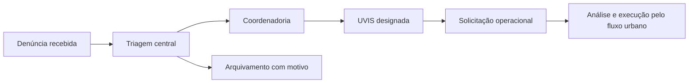

# Portal do Cidadão e triagem de denúncias

Manual do fluxo implementado em 25/09/2026. O cidadão registra uma ocorrência e recebe um protocolo. A equipe responsável faz a triagem, encaminha à coordenadoria e à UVIS, que pode gerar uma solicitação operacional. A denúncia não gera automaticamente uma OS nem uma aprovação de voo.

## Registro pelo cidadão

1. Abra `/portal-cidadao`, sem precisar de login.
2. Escolha o tipo de ocorrência e o foco. No tipo Aedes, informe também o tipo de local.
3. Informe endereço, número, bairro e cidade; confira os dados retornados pelo CEP ou pela localização. Acrescente descrição e complemento quando necessário.
4. Preencha nome, CPF e telefone com DDD. O RG é opcional. Os demais campos de identificação são obrigatórios; não se trata de uma denúncia anônima.
5. Se necessário, anexe até **cinco arquivos**. O backend admite imagens `png`, `jpg`, `jpeg`, `jfif`, `webp`, `heic` e vídeos `mp4`, `mov`, `avi`, `mkv`, `webm`.
6. Confirme o uso das informações para triagem e envie.
7. Guarde o protocolo apresentado após a confirmação do servidor.

Falhas de validação retornam mensagens por campo. Se não houver confirmação, não considere o registro concluído. Não foi identificada uma página pública de consulta do andamento por protocolo; o acompanhamento e a triagem ficam nas telas autenticadas.

O serviço valida a quantidade e a extensão de arquivos, mas não há limite de tamanho por arquivo explícito nesse fluxo. Os limites de infraestrutura e a validação de conteúdo precisam ser homologados pela operação. O manual não estabelece um limite que o servidor ainda não aplica.

## Triagem e encaminhamento

```mermaid
flowchart LR
    A[Denúncia recebida] --> B[Triagem central]
    B --> C[Coordenadoria]
    C --> D[UVIS designada]
    D --> E[Solicitação operacional]
    E --> F[Análise e execução pelo fluxo urbano]
    B --> G[Arquivamento com motivo]
```

| Responsável | Tela | Ação |
| --- | --- | --- |
| COVISA ou administração global | `/denuncias` | Consultar, abrir detalhe, encaminhar à coordenadoria e arquivar com motivo conforme a ação permitida. |
| Regional | `/coordenadoria/denuncias` | Consultar sua coordenadoria e designar uma UVIS da mesma região. |
| UVIS | `/uvis/denuncias` | Consultar denúncias atribuídas à própria conta e criar a solicitação pelo formulário. |

Os perfis centrais reconhecidos são `covisa`, `dev`, `diretor` e `admin`; o legado `visualizar` com região `COVISA` também é reconhecido. A prefeitura administradora não é automaticamente um perfil de triagem central. O backend verifica o escopo dos detalhes e anexos; a região da UVIS escolhida deve coincidir com a coordenadoria da denúncia.

Ao converter, confira os dados pré-preenchidos e complete o agendamento e os demais campos exigidos pela solicitação. A criação segue as validações do cadastro urbano. A denúncia guarda `solicitacao_id` e passa para `CONVERTIDA_SOLICITACAO`; o handler impede repetir a conversão quando esse vínculo já existe.

## Liberação da triagem em 09/10/2026

O item **Denúncias** está ativo na sidebar da COVISA, dos administradores globais, das coordenadorias e das UVIS, com contador de pendências para cada perfil.

Somente a triagem central pode encaminhar à coordenadoria ou arquivar com justificativa de pelo menos dez caracteres. A coordenadoria designa UVIS da própria região. Reencaminhar à coordenadoria remove a atribuição anterior à UVIS. Denúncias arquivadas ou convertidas não podem ser alteradas por essas ações.

A conversão grava a solicitação e seu vínculo com a denúncia na mesma transação. Uma falha desfaz ambas as alterações. As mutações bloqueiam a linha durante a transação nos bancos que suportam bloqueio de linha, evitando concorrência com outra ação de triagem.

Teste automatizado isolado: `tests/test_denuncias_workflow.py`, com fluxo completo, escopo regional, permissões, reencaminhamento, arquivamento, repetição de envio e falha na gravação.

## Estados registrados

| Estado | Significado |
| --- | --- |
| `RECEBIDA` | Registro criado pelo portal. |
| `EM_TRIAGEM_COVISA` | Estado previsto no modelo e considerado nas filas de triagem; não implica uma etapa automática ao abrir o detalhe. |
| `ENCAMINHADA_COORDENADORIA` | Encaminhamento regional registrado. |
| `ENCAMINHADA_UVIS` | UVIS designada. |
| `CONVERTIDA_SOLICITACAO` | Vínculo com solicitação operacional criado. |
| `ARQUIVADA` | Arquivamento com motivo. |

O fluxo atual privilegia a triagem por coordenadoria/UVIS. O modelo tem `prefeitura_id`, mas isso não equivale a uma política municipal aplicada automaticamente a todas as consultas. Para expansão a outros municípios, confira as regras com a equipe técnica.

## Boletim e notícias

O portal consulta dados e notícias externos e oferece `/portal-cidadao/boletim-dengue`, com seleção de doença e ano. O código trata dengue, chikungunya e zika e consulta o município configurado em `INFODENGUE_GEOCODE`/`INFODENGUE_CITY`.

Confira a semana, o ano, a fonte e a disponibilidade informada na tela. Os dados externos não são calculados a partir das denúncias nem das OS. Ausência de dados não representa zero ocorrências. A revisão do repositório não confirma disponibilidade atual ou atualização de um provedor externo.

## Conferência em homologação

Use uma denúncia fictícia para verificar registro, protocolo, erro de CPF/telefone, rejeição de sexto anexo, encaminhamento, região da UVIS, conversão e bloqueio de repetição. Repita a tentativa de abrir o detalhe/anexo com outra UVIS e outra regional. Valide também falha de CEP, armazenamento e boletim.

Fontes: [rotas públicas](../../app/modules/portal_cidadao/routes.py), [validações do registro](../../app/modules/portal_cidadao/service.py), [rotas de triagem](../../app/modules/denuncias/routes.py), [permissões e encaminhamento](../../app/modules/denuncias/service.py), [modelos](../../app/models.py), [testes de triagem](../../tests/test_denuncias_triagem.py).

## Assistente de IA do portal

O botão **Ajuda com IA**, em `/portal-cidadao`, orienta sobre o formulário, a
triagem e informações públicas de vigilância e prevenção. A conversa de IA não consulta protocolos ou dados internos. O registro de relatos é oferecido pelo formulário guiado dentro do painel, descrito abaixo.
As mensagens e até seis mensagens anteriores são enviadas à OpenAI. O navegador
mantém o histórico somente em memória; **Limpar conversa** o apaga. O backend
usa a Responses API com `store=False`, sem gravar mensagens no banco ou logs da
aplicação. Isso não equivale a uma garantia de retenção zero pelo provedor.

Configure `OPENAI_API_KEY` no `.env` local ou no ambiente de produção e reinicie
a aplicação. Nunca coloque a chave em templates, JavaScript ou no Git.
`OPENAI_CHAT_MODEL` permite trocar o modelo (padrão `gpt-6-luna`).
Sem chave, o chat informa indisponibilidade; o formulário continua disponível.

Há um limite de oito tentativas por minuto por IP e
`PORTAL_CHATBOT_DAILY_LIMIT` tentativas diárias (500 por padrão, dia UTC).
As tentativas com falha também contam. Contadores atômicos ficam em
`instance/portal_chat_quota.sqlite`, compartilhados entre workers do mesmo host.
Em múltiplas instâncias, cada instância tem sua própria quota; use armazenamento
compartilhado/limitação no gateway para um teto global. Atrás de proxy, o limite
por IP usa `request.remote_addr`; configure proxies confiáveis na infraestrutura
para evitar que todos os visitantes compartilhem o IP do proxy. Não se confia
em cabeçalhos de IP enviados diretamente pelo cliente.

O limite de requisições não é um teto monetário. Configure também o orçamento
no projeto da OpenAI. O saldo disponível não é verificado pela aplicação.

### GPT-6 Luna e fontes oficiais

O padrão é `gpt-6-luna`, com `reasoning.effort=low`, até 2.500 tokens de saída
(incluindo raciocínio) e até duas chamadas de ferramenta por resposta. Respostas
incompletas não são apresentadas como concluídas. O cliente da API tem timeout
de 50 segundos, sem retries automáticos; o navegador aguarda até 60 segundos.
O timeout de produção do Procfile é 180 segundos por padrão.

O contexto público inclui o catálogo real de focos do formulário, o município
configurado, a data local e as orientações documentadas de registro e triagem.
Não há consulta ao banco de denúncias, contas ou documentos internos. Mudanças no
fluxo de atendimento devem ser refletidas nas instruções de `chatbot.py`.

`PORTAL_CHATBOT_WEB_SEARCH_ENABLED=1` habilita a ferramenta `web_search` na
Responses API. As fontes permitidas são `gov.br`, `prefeitura.sp.gov.br`,
`saude.sp.gov.br` e `fiocruz.br`, incluindo subdomínios. O modelo decide quando
pesquisar; as instruções exigem pesquisa para informações externas atuais e
orientam a não pesquisar quando o contexto local basta. Essa decisão é do modelo,
não uma garantia determinística de busca. As pesquisas geram cobrança adicional.
Defina a variável como `0` para desativar a ferramenta.

As citações retornadas pela API são links junto às afirmações, renderizados com
texto seguro, sem interpretar HTML do modelo. Links são limitados a HTTPS e aos
domínios oficiais. Nenhuma fonte é inventada pelo backend. O histórico continua
apenas na memória do navegador; cada mensagem anterior aceita até 12.000
caracteres, com até seis mensagens e corpo total de até 500 KB.

O chat avisa sobre o envio das mensagens ao provedor. As instruções proíbem dados
pessoais em consultas web, mas não constituem um filtro automático de dados
pessoais: o texto digitado pelo cidadão é enviado à OpenAI. Não cole dados pessoais
ou clínicos. Para consultas particulares seria necessário outro fluxo, autenticado
com controle de acesso.

### Registrar relato dentro do assistente

O botão **Registrar relato** do chat abre cinco etapas: ocorrência, endereço,
identificação, detalhes/anexos e revisão com consentimento. Pedidos diretos como
“quero registrar um relato” também abrem esse fluxo local sem chamar a API de IA.

O formulário original é movido para o painel, preservando campos, arquivos e os
handlers existentes. Ao voltar à conversa, ele retorna à página com o rascunho.
Não há cópia em localStorage nem envio dos campos ou anexos à OpenAI. Recarregar
a página descarta o rascunho não enviado. Fechar o painel preserva a etapa.

Somente **Confirmar e enviar**, após marcar o consentimento, dispara o POST
multipart para `/portal-cidadao/denuncias`. O backend mantém as validações, o
armazenamento de anexos e a triagem existentes. Erros de campo retornam à etapa
correspondente; durante o envio os controles de navegação ficam bloqueados.
O protocolo exibido vem exclusivamente da resposta de sucesso do servidor.
Não há reenvio automático em falhas de rede: o resultado pode ser incerto, e o
cidadão recebe um aviso para evitar duplicar o registro.
