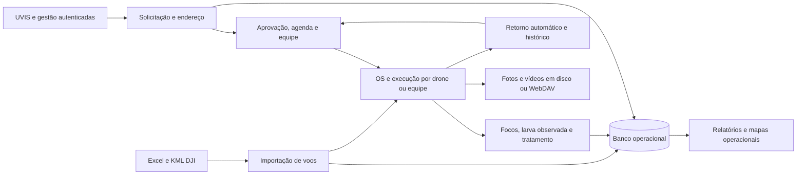
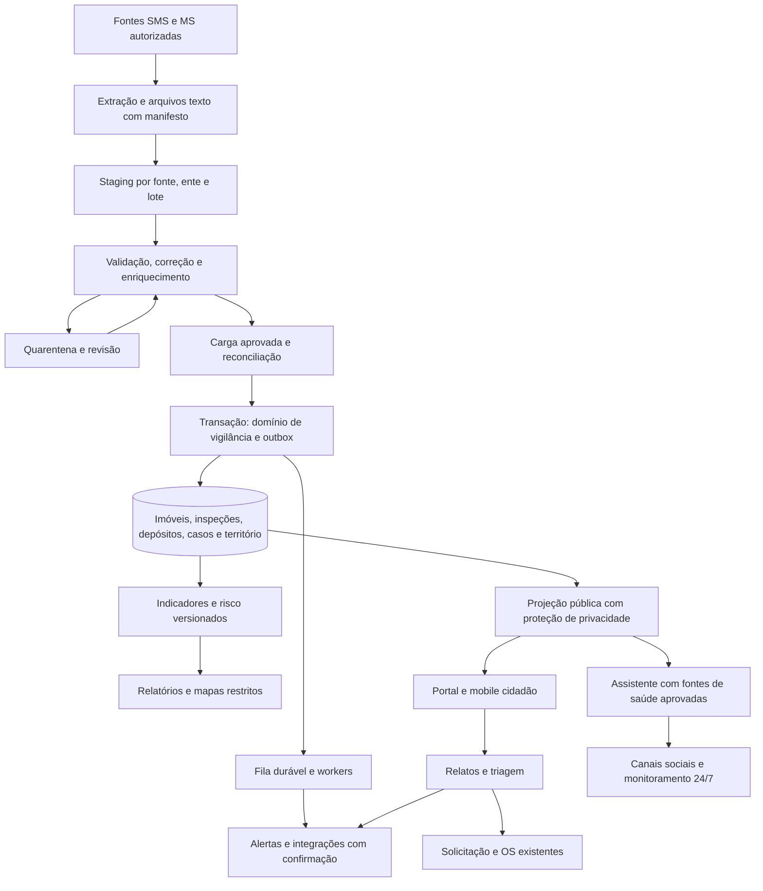

# Relatório de Análise de Aderência e Novas Demandas

## Interoperabilidade, migração de dados e vigilância epidemiológica

**Sistema analisado:** IJA System  
**Data da análise e revisão:** 15/09/2026  
**Revisão de código auditada:** `8e839c4787ce5c364a650d59ea0814be1a76e356`  
**Finalidade:** apresentação ao supervisor e apoio à definição da arquitetura, do plano de desenvolvimento e dos critérios de aceite  
**Situação do documento:** relatório técnico revisado com evidências de auditoria; homologação contratual pendente  
**Escopo:** itens 4.6.1, 4.7/4.7.1 e I a XVI do texto fornecido  

### Alterações incorporadas nesta revisão

- Classificação contratual separada do potencial de reaproveitamento técnico: **0 Atendidos, 3 Parcialmente Atendidos e 15 Não Atendidos** nos dezoito itens.
- Correção da leitura da terceira etapa de migração e inclusão explícita da importação do tratamento focal.
- Detalhamento da interoperabilidade por processo e da continuidade de vigilância e assistência.
- Inclusão de achados reproduzidos sobre autorização territorial, backup, mapas, segurança e execução assíncrona.
- Plano priorizado, critérios de aceite por item e catálogo de evidências incorporados ao próprio relatório.

Esta revisão atualiza a documentação. As correções de software descritas permanecem propostas; o código da aplicação não foi alterado.

---

## 1. Objetivo

Este relatório apresenta a análise do IJA System em relação aos requisitos recebidos para interoperabilidade, migração de dados, tratamento focal, LIRAa, SINAN, indicadores epidemiológicos, participação da sociedade civil, inteligência artificial e disponibilidade em redes sociais.

O levantamento busca responder a quatro perguntas:

1. Quais recursos o sistema já possui e podem ser reaproveitados?
2. Quais requisitos estão parcialmente atendidos?
3. Quais funcionalidades ainda precisam ser construídas?
4. Qual sequência de arquitetura e desenvolvimento é recomendada?

Esta análise considera o código-fonte, os modelos de dados, as rotas, as migrações, os testes automatizados e a documentação presentes no repositório. Não foram avaliados contratos com fornecedores, base de produção, infraestrutura contratada ou disponibilidade real dos serviços externos.

### 1.1 Fontes, método e limites

- Texto original em [pasted-text.txt](/Users/pedrohenriquevb/.codex/attachments/9b0211ad-2ec9-4bdf-9caa-f3d653cbd917/pasted-text.txt).
- PDF “Relatório de Análise de Aderência e Novas Demandas”, 23 páginas, fornecido pelo usuário; conteúdo integral extraído e páginas inspecionadas visualmente.
- Versão anterior deste relatório, confrontada com o código e consolidada nesta revisão.
- [README](/Users/pedrohenriquevb/Projetos/Empresa/Ija-System/README.md), [documentação técnica INPI em Markdown](/Users/pedrohenriquevb/Projetos/Empresa/Ija-System/docs/documentacao-tecnica-inpi-ija-system.md), documentação de retornos, upload e demais inventários pertinentes.
- Código de inicialização, modelos, registro de rotas, serviços relevantes, templates, clientes externos, migrações, configuração de execução e testes.

O texto colado repete I a XVI três vezes; foi contabilizado uma vez. As propostas arquiteturais contidas no relatório foram auditadas como propostas, sem transformá-las em novas obrigações do contrato.

### 1.2 Verificação realizada

Inventário estático de modelos, decoradores HTTP e grafo Alembic; rastreamento dos fluxos que correspondem aos requisitos; buscas transversais de importação, indicadores, dados sensíveis e integrações; execução da suíte existente; quatro reproduções locais de achados com dados sintéticos e serviços simulados. Não se alterou o código funcional.

Não foram inspecionados banco ou usuários de produção, contratos de fornecedores, infraestrutura implantada, credenciais, dados reais de pacientes ou o edital completo e seus anexos. Não foram executados testes contra a produção, homologação de SMS/MS, ensaios de carga, migração PostgreSQL ou medição real de disponibilidade. A documentação INPI foi consultada na versão Markdown; o DOCX não foi comparado visualmente.

**Não Atendido** significa que a implementação correspondente não foi identificada no material auditado. Não prova inexistência em outro repositório ou serviço não fornecido. As conclusões cobrem os requisitos apresentados; não certificam a integralidade de um edital não disponibilizado.

---

## 2. Observação sobre o texto recebido

O texto fornecido repete três vezes o mesmo conjunto de dezesseis funcionalidades. Este relatório considera os itens I a XVI uma única vez.

As três etapas de migração estão expressamente identificadas no original:

1. **I - Extração:** captura das fontes SMS/MS e armazenamento em arquivos texto.
2. **II - Validação dos dados:** limpeza, correção de inconsistências/duplicidades e enriquecimento.
3. **III - Validação lógica e física:** adequação ao formato utilizado pela solução.

Há retomada da numeração nos requisitos funcionais e repetição do bloco; a terceira etapa da migração não está ausente. Recomenda-se consolidar a apresentação do texto e obter o termo completo e seus anexos para fechar os critérios de aceite.

O item 4.6.1 admite interface síncrona **ou** assíncrona. A funcionalidade única por processo deve compartilhar regras de negócio entre seus canais, sem pressupor um único URL para todo o sistema. O item IX exige ambiente mobile, sem impor expressamente aplicativo nativo ou distribuição em lojas. PostGIS, RAG, FHIR/HL7, filas e mecanismos de anonimização descritos adiante são recomendações de arquitetura ou decisões de implementação a validar, não tecnologias obrigatórias citadas nesse trecho.

---

## 3. Resumo executivo

Pelo critério de atendimento da funcionalidade contratada, foram identificados **0 itens Atendidos, 3 Parcialmente Atendidos e 15 Não Atendidos**, considerando 4.6.1 e 4.7 como dois itens e I a XVI como outros dezesseis. Entre os dezesseis funcionais, são **3 parciais e 13 não atendidos**.

Os parciais são **II, VIII e XIII**: registros operacionais de focos/criadouros, relatórios e geolocalização com mídias constituem partes concretas desses processos. As principais ausências são integração institucional, migração de legados de saúde, importação focal/LIRAa/SINAN, indicadores e casos epidemiológicos, participação cidadã e IA em canais sociais.

Esta revisão classifica os itens I e IX como **Não Atendidos**: registro manual de OS não implementa importação focal/LIRAa, e interface mobile interna não entrega a jornada cidadã. O reaproveitamento desses componentes permanece registrado na matriz, sem ser confundido com atendimento do processo contratado. Interoperabilidade e migração também têm componentes reutilizáveis, mas não possuem fluxo institucional implementado para as fontes exigidas.

O total de itens não mede percentual de desenvolvimento, custo ou esforço. Uma interface reaproveitável não equivale a um processo contratado entregue.

Recomenda-se preservar o monólito modular e adicionar os domínios de interoperabilidade, migração, vigilância, participação cidadã e IA. A evolução deve começar por isolamento, segurança, recuperação e qualidade dos dados; indicadores e respostas de IA dependem de fontes oficiais e regras aprovadas.

---

## 4. Critérios de classificação

| Status | Regra aplicada |
|---|---|
| Atendido | Implementação correspondente ao objeto, aos dados e ao público exigidos, com evidência suficiente do processo completo. |
| Parcialmente Atendido | Parte concreta do processo funcional existe, mas faltam subcapacidades obrigatórias. |
| Não Atendido | O processo exigido está ausente, mesmo quando há bibliotecas, telas ou serviços genéricos reutilizáveis. |

Aplicações dessa regra: registro manual de OS não comprova importação de dados focais; manifesto mobile de sistema interno não comprova atendimento da sociedade civil; API de mapas não comprova integração com SMS/MS; importação DJI não comprova migração de bases de saúde.

Na seção de requisitos não funcionais, “Não demonstrado” é uma observação sobre falta de evidência de operação/infraestrutura; não substitui os três status usados na matriz contratual.

---

## 5. Capacidades existentes no IJA System

### 5.1 Estrutura técnica

O repositório analisado possui:

- 32 módulos em `app/modules`, além de `app/core` e componentes compartilhados;
- 58 modelos SQLAlchemy;
- 331 declarações de rotas;
- 112 revisões Alembic alcançáveis, com uma head (`b7c1e4f2a9d6`); aplicação em produção não inspecionada;
- 132 testes automatizados em 18 arquivos, aprovados na execução de auditoria;
- aplicação Flask modular;
- banco configurado por `DATABASE_URL`, com suporte a PostgreSQL e testes em SQLite;
- migrações com Alembic/Flask-Migrate;
- execução com Gunicorn;
- templates Jinja2 e frontend responsivo;
- estrutura básica de PWA com manifesto e service worker, sem comprovação de jornada cidadã ou operação offline; ver A08.

### 5.2 Operação de campo

O sistema já contempla:

- cadastro e acompanhamento de solicitações;
- ordens de serviço;
- agenda e distribuição operacional;
- atribuição de equipes e pilotos;
- tipos de visita Aedes, Culex e outros;
- classificação operacional de solicitações por tipo de imóvel e ponto estratégico, sem cadastro independente de imóvel de vigilância;
- cadastro de focos e indicação de criadouro;
- registro de larva visualizada;
- tratamento e cálculo de dosagem;
- retorno automático para nova inspeção;
- histórico encadeado de visitas;
- registro de fotos, vídeos e documentos;
- armazenamento externo de mídias;
- trajetos e rotas KML de drones.

### 5.3 Geolocalização e mapas

Existem recursos para:

- consulta e validação de CEP;
- geocodificação de endereços;
- armazenamento de latitude e longitude;
- Place ID do Google Maps;
- bloqueio preventivo de duplicidade por endereço;
- perímetro planejado e executado;
- consulta de pontos em mapas;
- código para mapa de calor de solicitações aprovadas, dependente de uma API retirada pelo fornecedor; ver A05;
- visualização de rotas KML;
- contexto operacional com solicitações próximas.

O mapa de calor usa concentração de solicitações aprovadas e data de agendamento. Não calcula IIP nem risco epidemiológico. O template usa `HeatmapLayer`, informado pelo Google como indisponível desde maio de 2026, e fixa `ano=2026` nas consultas. A disponibilidade real do mapa na implantação não foi testada. [Google Maps - depreciações](https://developers.google.com/maps/deprecations).

### 5.4 Relatórios

O sistema já gera:

- tabelas e indicadores operacionais;
- gráficos por status, região, unidade e foco;
- relatórios de solicitações;
- relatórios de ordens de serviço;
- relatórios de larvas e tratamentos;
- relatórios de coleta de imagens;
- relatórios de retornos automáticos;
- exportações em PDF;
- exportações em Excel;
- filtros por período, prefeitura, região, UVIS, equipe, status, foco, endereço e outros campos operacionais.

### 5.5 Integrações existentes

Foram identificadas integrações ou preparações para:

- Google Maps e geocodificação;
- ViaCEP e BrasilAPI;
- Open-Meteo;
- armazenamento Skybox/Nextcloud via WebDAV;
- Dropbox para backup e currículos;
- Gemini para normalização de planilhas e análise de currículos;
- RedGPS para rastreamento de veículos;
- PostgreSQL;
- GitHub Actions e Render para monitoramento e recuperação.

Essas integrações demonstram capacidade técnica, mas não representam interoperabilidade com os sistemas oficiais da Secretaria Municipal de Saúde ou do Ministério da Saúde.

### 5.6 Segurança, escopo e rastreabilidade

O sistema possui:

- senha armazenada por hash;
- autenticação com Flask-Login;
- perfis de acesso;
- filtros por prefeitura, região, UVIS, equipe e usuário, com falhas de isolamento identificadas nos achados A01/A02;
- auditoria de mutações selecionadas;
- registro de IP e user agent;
- health checks da aplicação e do banco;
- watchdog de disponibilidade;
- rotina de backup diário e envio externo, com falso sucesso de envio reproduzido e restauração não comprovada; ver A04;
- tratamento controlado de erros;
- validação de nomes/extensões em caminhos de upload; isso não comprova verificação uniforme de conteúdo, antivírus ou remoção de metadados.

### 5.7 Fluxos atuais e evidências de arquitetura

Há dados de solicitação, geocodificação, equipe, larva visualizada, produto/dosagem, criadouro em texto, fotos, vídeos e retorno. **Não há entidade de paciente/caso, levantamento amostral LIRAa, inspeção entomológica normalizada ou denominador para IIP.**

Evidências: [Solicitacao](/Users/pedrohenriquevb/Projetos/Empresa/Ija-System/app/models.py:418), [OrdemServico](/Users/pedrohenriquevb/Projetos/Empresa/Ija-System/app/models.py:548), [OrdemServicoEquipeUvis](/Users/pedrohenriquevb/Projetos/Empresa/Ija-System/app/models.py:689), [catálogo de focos](/Users/pedrohenriquevb/Projetos/Empresa/Ija-System/app/shared/solicitacao_focos.py:6), [geração de retorno](/Users/pedrohenriquevb/Projetos/Empresa/Ija-System/app/modules/piloto_os/service.py:933).

### 5.8 APIs e integrações por processo

**Contexto operacional informado pelo responsável pelo sistema:** a Prefeitura envia endereços para atendimento; o IJA agenda e executa a pulverização; depois devolve ordens de serviço e relatórios. Esse fluxo deve ser considerado uma fonte oficial operacional municipal para a primeira fatia de evolução. O código auditado, isoladamente, não permite identificar se o envio atual ocorre por tela, planilha, e-mail, API ou outro meio, nem comprovar autenticação, versionamento, idempotência, reconciliação e continuidade conforme 4.6.1. Por isso, a classificação contratual permanece conservadora até que esse processo seja documentado e demonstrado ponta a ponta.

| Interface/componente atual | Função e limite para o contrato |
|---|---|
| `/api/geocode`, `/api/cep/*` | Endereços e coordenadas; não trocam registros de vigilância com SMS/MS. |
| `/api/heatmap-data` | Retorna latitude, longitude e foco de solicitações aprovadas. |
| `/api/dji-kml-route/<id>` e importadores DJI | Voos, trajetos e vínculo com OS; sem layout focal/LIRAa/SINAN. |
| `/api/os/*` e `/api/video-upload-*` | Upload, consulta e exclusão de mídias operacionais. |
| `/api/*/chatbot` | FAQ interno por palavras-chave; não é assistente público de saúde. |
| `/api/drones/importar-planilha` | Cadastro de equipamentos com normalização Gemini; não migra dados sanitários. |
| `/api/watchdog/deploy-events` | Exceção relevante à autenticação por sessão: possui token de máquina, restrito ao watchdog. |
| Skybox/WebDAV, Dropbox, Google Maps, CEP, clima, RedGPS e Gemini | Integrações operacionais ou capacidades configuráveis; sua existência não comprova funcionamento em produção nem integração institucional. |

Predomina autenticação por sessão Flask-Login. Não foi localizado no código um catálogo de processos institucionais, contrato OpenAPI de vigilância, autenticação de máquina por ente/processo, versionamento de layout oficial ou trilha técnica completa de entrega ponta a ponta para SMS/MS. O fluxo operacional municipal descrito acima precisa ser documentado com seus artefatos reais para complementar a evidência de código. A dependência `openai` na lista de pacotes também não comprova um assistente implementado.

---

## 6. Interoperabilidade e migração de dados

### 6.1 Interoperabilidade - item 4.6.1

| Subobrigação | Situação contratual | Evidência que falta para aceite |
|---|---|---|
| Interagir com sistemas SMS e MS | Não Atendido no critério estrito; fluxo municipal operacional informado, ainda sem evidência técnica suficiente | Formalizar o fluxo Prefeitura → IJA → Prefeitura com meio de envio, contrato, autenticação, chaves, transações, reconciliação e continuidade; acrescentar as interfaces do MS exigidas pelo contrato. |
| Preservar macroprocessos de vigilância e assistência na transição | Não Atendido | Matriz de processo x sistema responsável antes/durante/depois, coexistência, reconciliação incremental, virada, contingência e retorno ao legado ensaiados. |
| Acesso síncrono **ou** assíncrono | Não Atendido no domínio institucional | Definição do modo por processo, confirmação/erro, prazos e retomada quando aplicável. Threads locais de upload não constituem intercâmbio institucional. |
| Funcionalidade única por processo | Não Atendido | Catálogo que relacione cada processo a um serviço de negócio, contrato e responsável; regras comuns entre interface humana, API e importador. |
| Implantar, parametrizar e customizar por especificidades | Não Atendido | Configuração versionada por ente/fonte, regras, filtros, limites territoriais e evidências de homologação. Ter `prefeitura_id` não realiza essa parametrização. |

“Funcionalidade única” não determina necessariamente um único URL para todo o sistema. Recomenda-se contrato de negócio único por processo, com canais e adaptadores que executem as mesmas regras. O trecho permite comunicação síncrona **ou** assíncrona; não exige os dois modos em cada interface.

### 6.2 Migração - itens 4.7 e 4.7.1

| Etapa | Situação contratual | Entrega mínima recomendada |
|---|---|---|
| I - Extração para arquivos texto | Não Atendido | Extrator por origem; cópia bruta preservada; exportação textual com encoding, delimitador, datas, nulos e zeros à esquerda definidos; manifesto/hash/contagens e registros de origem. Backup SQL do IJA é outro processo. |
| II - Limpeza e correção | Não Atendido | Regras por linha/campo e entre registros; separação de erro, ausência, duplicidade e conflito; quarentena e correção rastreável. |
| II - Enriquecimento | Não Atendido | Atributos adicionais acordados, fonte e data do enriquecimento, preservação do valor original e revisão quando a qualidade for insuficiente. |
| III - Validação lógica/física e adequação | Não Atendido | Conversão de tipos/códigos, integridade referencial, unicidade, consistência temporal/territorial, prévia, carga transacional e reconciliação. |

As validações e hashes existentes nos importadores podem acelerar a construção, mas ainda não foram aplicados às fontes contratuais. **Migração Alembic de schema é diferente de migração dos dados legados da SMS/MS.**

### 6.3 Controles propostos para o novo processo de migração

Cada importação deverá possuir:

- fonte e versão do layout;
- prefeitura/ente responsável;
- usuário responsável;
- data e hora de recebimento;
- hash do arquivo;
- quantidade total de registros;
- registros aceitos, rejeitados e duplicados;
- erros por linha e campo;
- dados originais preservados;
- dados transformados;
- status do lote;
- aprovação antes da carga definitiva;
- reconciliação entre origem e destino;
- possibilidade de rollback;
- relatório final de migração.

Esses controles são recomendações para comprovar a entrega das três etapas. Definir ainda encoding, delimitador, nulos, datas, zeros à esquerda, chaves de origem e tratamento de revisões/cancelamentos. Uma importação repetida não pode duplicar casos, imóveis ou ações.

---

## 7. Matriz de cobertura contratual

Nas referências abaixo, `E` identifica o catálogo de evidências da seção 16.2. O componente proposto é uma recomendação de implementação, não um módulo já existente.

| Item | Status | Componente atual e evidência | Lacuna e componente a desenvolver |
|---|---|---|---|
| **4.6.1** | **Não Atendido** | Clientes HTTP, rotas JSON, escopo por prefeitura e watchdog; E01, E07, E10. | Módulo de interoperabilidade com fontes SMS/MS, catálogo por processo, contrato funcional único, parametrização por ente, semântica de intercâmbio e plano de continuidade de vigilância **e assistência** durante implantação. |
| **4.7 / 4.7.1** | **Não Atendido** | Importadores DJI/equipamentos e backup do próprio banco; E05, E06, E12. | Processo completo de extração de legados para texto, limpeza/correção/deduplicação, enriquecimento e validação lógica/física até a carga reconciliada. |
| **I - Importar focal e LIRAa** | **Não Atendido** | OS e tratamentos manuais; importações de voos/equipamentos; E02, E05, E06. | Dois fluxos de origem explicitamente contemplados: ações de tratamento focal e levantamentos LIRAa. Layouts, importação, validação, atualização e vínculo com imóveis/inspeções. |
| **II - Depósitos preferenciais** | **Parcialmente Atendido** | Foco, criadouro booleano, tipo/volume textual, larva e retornos; E02, E03. | Depósito por inspeção, classificação oficial, quantidade, positividade/especiação quando aplicável, tratamento, frequência e séries por área/período. |
| **III - Mapear IIP** | **Não Atendido** | Coordenadas e mapa de solicitações; E02, E07. | Imóveis pesquisados/positivos, levantamento/estrato/período, cálculo auditável e camada territorial com legenda, cobertura e atualização. |
| **IV - Ações para a sociedade** | **Não Atendido** | Solicitações e relatórios internos; E04, E08. | Portal público que permita conhecer e participar das ações de prevenção, controle e eliminação; não limitar a entrega a transparência passiva. |
| **V - Indicadores SINAN** | **Não Atendido** | Sem conector, layout ou entidades SINAN; E01, E02, E05. | Adaptador autorizado por fonte/versão, indicadores acordados, série histórica, atualizações e proveniência. |
| **VI - Casos suspeitos e confirmados** | **Não Atendido** | Geocoder de endereços operacionais; E07. | Casos com origem SINAN, evolução da classificação, endereço protegido, geocodificação com qualidade/revisão e mapa de acesso restrito. Indicadores agregados isolados não bastam. |
| **VII - Alerta após suspeita cidadã** | **Não Atendido** | `Notificacao` e lembretes operacionais; E09. | Relato cidadão distinto de notificação oficial, triagem, regra de alerta, destinatários da gestão, entrega, ciência, escalonamento e acompanhamento. |
| **VIII - Relatórios filtrados** | **Parcialmente Atendido** | Tabelas, gráficos, PDF/Excel e filtros operacionais; E08. | Indicadores epidemiológicos/entomológicos, filtros aprovados pela vigilância, mapas compatíveis e mesma base temporal em tabela/gráfico/mapa/exportação. |
| **IX - Mobile cidadão e IEC** | **Não Atendido** | Frontend responsivo e manifesto internos; E04, E11. | Jornada pública mobile, informação/educação/comunicação em saúde, interação com vigilância e acessibilidade. Não há essa experiência para cidadãos no código. |
| **X - Cidadão fiscalizador** | **Não Atendido** | Cadastro restrito a perfis institucionais; E04. | Formulário cidadão para domicílio/escola/trabalho, localização, evidências pertinentes, protocolo protegido e retorno da gestão. |
| **XI - Compartilhamento social** | **Não Atendido** | Links telefônicos/WhatsApp não implementam compartilhamento das ações; E01, E04. | Ações proativas publicáveis, links/cartões próprios para compartilhamento, conteúdo público seguro e validação nos canais acordados. |
| **XII - Integração espacial e indicadores** | **Não Atendido** | Mapa e OS sem domínio epidemiológico; E02, E07. | Relação entre casos, indicadores, focal/LIRAa, inspeções, depósitos, imóveis e geometrias, com área e período compatíveis. |
| **XIII - Áreas estratégicas e pendências** | **Parcialmente Atendido** | PE cadastrado, coordenadas/perímetros, retorno, motivo de não realização e fotos/vídeos de OS; E02, E03, E13. | Imóvel pendente como entidade, motivo e tentativas, inspeção peri/extradomiciliar, classificação das mídias, responsável e indicador de redução por área/período. |
| **XIV - Risco de surtos/epidemias** | **Não Atendido** | Concentração de solicitações e geofencing aeronáutico; E07, E16. | Identificar criadouros expostos ao ar livre, imóveis positivos, IIP e área inspecionada; cruzamento espacial/temporal e regras de risco validadas. |
| **XV - Assistente público com IA** | **Não Atendido** | FAQ por correspondência de palavras; Gemini em equipamentos/currículos; E06, E10. | Assistente em aplicativo para sociedade, fontes de saúde validadas, unidades de saúde, doenças, mosquito e áreas de risco; avaliação de respostas e proteção de dados. |
| **XVI - IA 24/7 em redes sociais** | **Não Atendido** | Health checks e watchdog da aplicação; E12, E14. | Canais sociais acordados, integração de conversas, IA efetiva disponível continuamente, monitoramento ponta a ponta, recuperação e comprovação de disponibilidade. |

Os itens I a XVI correspondem, respectivamente, aos identificadores RF-01 a RF-16 da versão anterior. Os itens 4.6.1 e 4.7 são contabilizados uma vez cada, totalizando dezoito requisitos na matriz.

---

## 8. Mapeamento dos requisitos não funcionais e operacionais

Esta seção diferencia capacidades técnicas gerais de atendimento institucional. Inclui recomendações de sustentação e pontos cuja comprovação depende da infraestrutura e dos anexos contratuais.

| ID | Requisito | Situação observada | Necessidade identificada |
|---|---|---|---|
| RNF-01 | Interoperabilidade SMS/MS | Não Atendido | Catálogo por processo, contratos versionados, adaptadores e homologação com cada origem/destino. |
| RNF-02 | Interfaces síncronas ou assíncronas institucionais | Não Atendido | Definir o modo por processo e implementar confirmação/erro, idempotência e recuperação. Chamadas HTTP e threads operacionais são componentes reutilizáveis. |
| RNF-03 | Continuidade na implantação | Não Atendido | Coexistência de vigilância e assistência, carga incremental, reconciliação, virada, retorno ao legado e contingência. |
| RNF-04 | Parametrização institucional por ente | Não Atendido | Layouts, regras epidemiológicas, filtros, alertas, credenciais e geografia versionados por ente/fonte. |
| RNF-05 | Disponibilidade 24/7 | Não demonstrada | IA/canais sociais ausentes; definir SLA/SLO e comprovar jornadas completas, redundância, recuperação e contingência. |
| RNF-06 | Integridade e qualidade de dados | Parcialmente Atendido na base operacional | Validadores e hashes especializados existem; falta pipeline de saúde com staging, quarentena, correção, enriquecimento e reconciliação. |
| RNF-07 | Segurança e proteção de dados | Parcialmente Atendido | Corrigir isolamento, CSRF/TLS e segredos; definir finalidade/base legal, minimização, retenção, descarte, acesso sensível e fornecedores. |
| RNF-08 | Usabilidade mobile | Parcialmente Atendido na interface interna | Criar e validar jornada cidadã/IEC; isso não altera o status Não Atendido do item IX. |
| RNF-09 | Acessibilidade | Não demonstrada | Definir padrão e critérios aplicáveis; validar teclado, contraste, leitores de tela, conteúdo e dispositivos-alvo. |
| RNF-10 | Escalabilidade e resiliência | Parcialmente Atendido | Metadados JSON locais não garantem retomada da execução; adotar workers separados, fila durável e armazenamento compartilhado. |
| RNF-11 | Auditoria e rastreabilidade | Parcialmente Atendido | Ampliar seleção de eventos, leitura/exportação sensível, objeto, ente, correlação, origem e proteção da trilha. |
| RNF-12 | Portabilidade e contratos de dados | Parcialmente Atendido na base operacional | Padronizar APIs/layouts e versionamento; documentar contratos e exportações. FHIR/HL7 somente conforme interface/processo acordado. |
| RNF-13 | Observabilidade | Parcialmente Atendido | Complementar health checks/watchdog com filas, entregas, atualização de dados, alertas e sondas por canal social. |
| RNF-14 | Manutenibilidade e testabilidade | Parcialmente Atendido | Há modularização e 132 testes existentes; faltam CI de testes, frontend, contratos institucionais, migração PostgreSQL, carga e segurança entre entes. |

A base legal deve ser definida por finalidade; consentimento não é condição universal para tratar dados de saúde em políticas públicas. Separar ciência do aviso, autorização de publicação e consentimento quando aplicável, conforme o art. 11 da [LGPD, texto oficial](https://www.planalto.gov.br/ccivil_03/_ato2015-2018/2018/lei/l13709.htm).

---

## 9. Arquitetura recomendada

Recomenda-se evoluir o monólito modular atual e executar trabalhos demorados fora do processo web. As tecnologias e mecanismos abaixo são propostas de arquitetura a validar com o contratante. PostGIS é uma opção coerente para consultas espaciais; RAG é uma alternativa para respostas baseadas em fontes; nenhuma dessas tecnologias é imposta pelo trecho fornecido.

### Fluxo proposto

### 9.1 Módulo de interoperabilidade

Responsabilidades:

- API versionada;
- documentação OpenAPI;
- adaptadores para cada sistema externo;
- autenticação de máquina;
- serviço de negócio único por processo, reutilizado entre canais;
- comunicação síncrona ou assíncrona conforme o contrato da interface;
- plano de coexistência e continuidade de vigilância e assistência;
- idempotência;
- retries e fila de falhas;
- log de requisições e entregas;
- configurações por ente.

### 9.2 Módulo de migrações

Responsabilidades:

- extração autorizada das fontes SMS/MS e geração de arquivos texto;
- recebimento de arquivos com manifesto, hash e proveniência;
- staging;
- validação por layout;
- normalização;
- enriquecimento;
- deduplicação;
- correção assistida;
- aprovação de lote;
- carga definitiva;
- reconciliação;
- rollback;
- relatório de aceite.

### 9.3 Módulo de vigilância epidemiológica

Responsabilidades:

- casos suspeitos e confirmados;
- importação e atualização de dados de origem SINAN;
- importação das ações de tratamento focal;
- levantamentos LIRAa;
- estratos e amostras;
- imóveis inspecionados;
- imóveis positivos;
- depósitos/criadouros;
- indicadores entomológicos;
- ações de controle;
- vínculo com solicitações e OS existentes.

### 9.4 Módulo geoespacial e de risco

Responsabilidades:

- geometrias com PostGIS;
- polígonos administrativos;
- camadas temáticas;
- cálculo de IIP;
- correlação espacial e temporal;
- áreas de risco;
- versão e explicação do algoritmo;
- anonimização de mapas públicos.

### 9.5 Módulo de participação cidadã

Responsabilidades:

- registro público de suspeitas;
- localização do relato;
- fotos e vídeos;
- aviso de privacidade, base legal por finalidade e consentimento quando aplicável;
- protocolo de acompanhamento;
- triagem e moderação;
- conversão em solicitação/OS;
- devolutiva ao cidadão;
- transparência das ações concluídas.

### 9.6 Módulo de alertas

Responsabilidades:

- regras configuráveis;
- severidade;
- destinatários;
- notificações multicanal;
- reconhecimento de ciência;
- escalonamento;
- encerramento;
- histórico e auditoria.

### 9.7 Assistente de saúde e redes sociais

Responsabilidades:

- base de conhecimento validada pela área de saúde;
- informações sobre unidades de saúde;
- conteúdos sobre doenças e mosquito;
- consulta de áreas de risco com proteção de privacidade;
- respostas com fontes rastreáveis, utilizando RAG se essa abordagem for escolhida;
- guardrails para impedir diagnóstico médico indevido;
- transferência para atendimento humano;
- integração com os canais definidos pelo contratante;
- métricas de disponibilidade, qualidade e segurança.

### 9.8 Regras de negócio e de dados a especificar

1. **IIP:** modelar numerador e denominador, não apenas armazenar um percentual. A relação básica é `100 × imóveis positivos / imóveis pesquisados`, conforme [orientação pública da Secretaria Municipal de Saúde de Poços de Caldas](https://pocosdecaldas.mg.gov.br/noticias/primeiro-liraa-de-2025-comeca-nesta-segunda-feira-quase-3-mil-imoveis-serao-visitados/). Confirmar metodologia, espécie, unidade amostral, estrato, período e agregação com a vigilância. Sem denominador, exibir indisponível; não converter ausência em zero.
2. **Amostragem e depósitos:** preservar o método LIRAa e suas unidades, classificações e levantamentos. Visitas direcionadas de drone têm seleção diferente de pesquisa amostral; não usar contagem de OS como denominador. IIP, ITR e IB são indicadores distintos na [descrição do Ministério da Saúde](https://www.gov.br/saude/pt-br/assuntos/saude-de-a-a-z/a/aedes-aegypti/vigilancia-entomologica). Além do IIP explicitamente exigido, outros indicadores dependem da lista acordada.
3. **Importação SINAN:** não pressupor API pública universal ou versão única. O portal disponibiliza documentação e dicionário, e descreve exportação DBASE no SINAN Online. Confirmar fonte/versão e autorização; se a origem exportar DBF, preservar o bruto e produzir o intermediário textual exigido. [SINAN - Dengue](https://portalsinan.saude.gov.br/dengue), [SINAN - perguntas frequentes](https://portalsinan.saude.gov.br/perguntas-frequentes).
4. **Identidade e atualização:** separar pessoa, episódio e notificação; não deduplicar só por nome, endereço ou hash do arquivo. Registrar a chave oficial, ente/fonte, versão e resultado de reconciliação. Uma revisão de classificação não é necessariamente um caso novo.
5. **Tempo e geografia:** distinguir data clínica, coleta, notificação, encerramento, atualização e carga; períodos epidemiológicos devem seguir o calendário definido. Cruzamentos precisam usar áreas e períodos comparáveis. Registrar dados atrasados e recálculo do indicador.
6. **Geocodificação:** guardar qualidade/precisão, tentativas e revisão. Centroide do CEP não deve ser apresentado como posição exata de imóvel. O geocoder atual seleciona o primeiro resultado e não persiste esses critérios de qualidade.
7. **Risco:** regra rastreável que use criadouro ao ar livre, imóvel positivo e IIP, com período, versão, fontes e explicação. O item XIV não obriga previsão por aprendizado de máquina. Falta de dados deve ser sinalizada, não convertida em baixo risco.
8. **Pendência:** definir numerador/denominador do índice de pendência, motivos e população de referência; comparar antes/depois em área e período equivalentes. Retorno de OS não prova eliminação da pendência.
9. **Relato cidadão:** não tratar autorrelato como diagnóstico ou como notificação SINAN confirmada. Encaminhar à equipe apropriada; definir prioridades e prazo para alerta/ciência. Separar relato de foco de relato de suspeita de adoecimento.
10. **Privacidade:** papéis por finalidade e ente, campos mínimos por consumidor, acesso protegido a casos, retenção, direitos e descarte. Pseudonimização não torna automaticamente seguro um mapa de residências. Agregação territorial, supressão de grupos pequenos e revisão de mídias devem ser avaliadas antes de publicação.
11. **IA:** base validada, fontes/atualização, limites de resposta, proteção contra entrada maliciosa, isolamento de dados e avaliação por conjunto de perguntas. RAG é uma alternativa; qualidade não é comprovada apenas pelo uso de modelo generativo. Transferência humana e fallback devem ter escopo e horário claros, sem substituir a IA exigida 24/7.
12. **Disponibilidade:** definir SLO/SLA por jornada e canal, janela de medição, manutenção, latência e critérios de falha. RTO é o tempo máximo de recuperação; RPO, a perda de dados tolerável. Os valores devem vir do contrato/acordo de aceite, não ser inventados nesta auditoria.

---

## 10. Modelo de dados inicial sugerido

### Interoperabilidade e migração

- `FonteSistema`
- `ConfiguracaoIntegracao`
- `ImportacaoLote`
- `ImportacaoRegistro`
- `ErroValidacao`
- `MapeamentoCampo`
- `EventoOutbox`
- `EntregaIntegracao`
- `ProcessoIntegracao`
- `EventoInbox`
- `ReconciliacaoLote`

### Vigilância

- `ImovelVigilancia`
- `InspecaoCampo`
- `DepositoInspecionado`
- `LevantamentoLiraa`
- `EstratoLiraa`
- `AmostraLiraa`
- `IndicadorEntomologico`
- `CasoArbovirose`
- `AcaoControle`
- `PendenciaImovel`
- `TentativaInspecao`
- `HistoricoClassificacaoCaso`

### Risco e alertas

- `AreaGeografica`
- `CamadaGeografica`
- `CalculoRisco`
- `RegraAlerta`
- `AlertaSaude`
- `DestinatarioAlerta`
- `HistoricoAlerta`

### Sociedade civil e IA

- `RegistroCidadao`
- `EvidenciaCidada`
- `RegistroPrivacidadeCidadao` (ciência de aviso, finalidade e consentimento quando aplicável)
- `PublicacaoAcao`
- `ConteudoSaude`
- `UnidadeSaude`
- `ConversaAssistente`
- `MensagemAssistente`
- `CanalAtendimento`

Casos de saúde e dados sensíveis não devem ser adicionados diretamente à tabela atual de solicitações. As novas entidades devem possuir vínculos controlados com a solicitação ou OS quando um evento epidemiológico gerar uma ação operacional.

### Dados e relações mínimas por domínio

| Domínio | Estrutura recomendada |
|---|---|
| Interoperabilidade | Fonte, ente, processo, contrato/layout, credencial com escopo, entrega, erro, correlação, outbox/inbox e idempotência. |
| Migração | Lote, arquivo bruto/hash, registro de origem, transformação/versão, erro, revisão, aprovação, carga, reconciliação e reversão/compensação. |
| Entomologia | Imóvel estável, inspeção, tipo de ação (focal/LIRAa), ciclo, levantamento, estrato/amostra, depósito, resultado, espécie quando aplicável, tratamento e positividade. |
| Epidemiologia | Caso/notificação de origem, agravo, classificação e evolução, datas de sintomas/notificação/encerramento/importação quando disponíveis; endereço e pessoa em acesso restrito. |
| Território | Município, unidade/área, polígono e versão/vigência; coordenada, referência espacial, precisão, fonte e revisão. |
| Pendências | Imóvel, motivo, tentativa, responsável, prazos, inspeção peri/extradomiciliar, evidência, resolução e histórico. |
| Participação | Relato, local, canal, protocolo não enumerável, triagem, encaminhamento e devolutiva; conteúdo educativo aprovado e ação compartilhável. |
| IA e canais | Conteúdo/fonte/validade, unidade de saúde e horários/serviços quando acordados, conversa, mensagem, canal, entrega, avaliação e escalonamento. |

PostgreSQL com PostGIS é uma opção coerente para polígonos, índices e consultas espaciais; é recomendação técnica. A escolha final deve considerar a infraestrutura contratada, volume e operação. OpenAPI, versionamento e contratos de dados são recomendados; FHIR/HL7 só se o processo e a interface de origem os exigirem ou adotarem.

---

## 11. Achados e correções técnicas prioritárias

Prioridades: **P0** antes de receber dados sensíveis ou declarar atendimento; **P1** antes da homologação do processo afetado; **P2** robustez e manutenção. A severidade é contextual, sem atribuição de CVSS ou alegação de incidente em produção.

### A01 - P0: autorização de KML sem isolamento por prefeitura

Em `can_access_dji_kml_route`, membros de `ADMIN_PANEL_VIEW_TYPES`, incluindo `prefeitura_admin`, são autorizados apenas por `can_access_regiao`. Esse helper retorna verdadeiro para quem não é `regional`; o `prefeitura_id` do recurso não é comparado.

**Reprodução:** administrador sintético da prefeitura 1 e OS sintética da prefeitura 2 produziram autorização `True`. A mesma função guarda consulta JSON, visualização e download KML. O payload contém trajetos, piloto e vínculo com OS. Não foram acessados registros reais.

**Correção:** aplicar autorização por objeto, prefeitura e perfil antes de obter payload ou arquivo; usar a mesma política para mapa, download, exportação e mídias. Testar negação entre entes, inclusive quando a região tem o mesmo nome.

Evidências: [helper KML](/Users/pedrohenriquevb/Projetos/Empresa/Ija-System/app/modules/dji_flight_logs/service.py:63), [helper regional](/Users/pedrohenriquevb/Projetos/Empresa/Ija-System/app/shared/access.py:135), [API KML](/Users/pedrohenriquevb/Projetos/Empresa/Ija-System/app/modules/dji_flight_logs/routes.py:126).

### A02 - P0: ausência de prefeitura pode remover o filtro territorial

`apply_prefeitura_scope` retorna a consulta sem filtro quando o usuário não tem prefeitura, exceto para `prefeitura_admin`. Não é equivalente a autorizar somente administradores globais explícitos.

**Reprodução:** perfil sintético `visualizar`, sem prefeitura e sem região, recebeu pontos de duas prefeituras por `build_heatmap_points`. Pode haver uso legado intencional desse comportamento; não há evidência que permita considerá-lo seguro para o domínio de saúde multi-ente.

**Correção:** negar acesso por padrão quando faltar escopo; representar a autorização global por permissão explícita; revisar dados legados antes da mudança e separar gestão operacional de acesso nominativo a casos.

Evidências: [escopo municipal](/Users/pedrohenriquevb/Projetos/Empresa/Ija-System/app/shared/access.py:94), [consulta do mapa](/Users/pedrohenriquevb/Projetos/Empresa/Ija-System/app/modules/mapas/service.py:24).

### A03 - P0: proteção de requisições e transporte incompleta

Não foi encontrada inicialização global de CSRF; referências esparsas a token em templates não implementam a verificação de servidor. CSP está explicitamente desativada com `content_security_policy=None`. A consulta de CEP usa `verify=False`. O backup imprime prefixos de chave e segredo Dropbox. Existe fallback de `SECRET_KEY` aleatório, que pode provocar sessões inconsistentes entre processos/restarts se a chave fixa faltar.

**Correção:** proteção CSRF nos fluxos por cookie; autenticação e autorização próprias nos fluxos de máquina; TLS validado; remoção dos logs de credenciais; exigência de segredo estável em produção; CSP compatível com os scripts usados, começando com observação antes de enforcement. Adicionar limites de requisição/volume em login, relato público, geocodificação e uploads. Não foi avaliada uma possível proteção adicional no proxy de produção.

Evidências: [extensões](/Users/pedrohenriquevb/Projetos/Empresa/Ija-System/app/extensions.py:6), [Talisman](/Users/pedrohenriquevb/Projetos/Empresa/Ija-System/app/__init__.py:161), [CEP](/Users/pedrohenriquevb/Projetos/Empresa/Ija-System/app/clients/cep_client.py:14), [log de backup](/Users/pedrohenriquevb/Projetos/Empresa/Ija-System/app/modules/backup/service.py:31), [segredo](/Users/pedrohenriquevb/Projetos/Empresa/Ija-System/config.py:11).

### A04 - P0: falso sucesso no backup e recuperação não comprovada

`run_postgres_backup` retorna o arquivo mesmo quando `upload_to_dropbox` retorna falso. `run_backup_async` então preenche `last_file` com mensagem de envio à nuvem e deixa `last_error` vazio.

**Reprodução:** dump simulado bem-sucedido e upload simulado falho resultaram em “Enviado para Nuvem” e `last_error = null`. A execução não fez dump nem acessou Dropbox.

O scheduler inicia no registro do blueprint. A trava `_scheduler_started` e `max_instances=1` pertencem ao processo; não coordenam os dois workers padrão do Procfile. Reinícios também interrompem tarefas locais. O dump cobre o banco atual; restauração consistente com arquivos locais/WebDAV e chaves não foi comprovada.

**Correção:** estados distintos para extração, envio e verificação; falhar/alertar se o envio falhar; agendador único ou trava distribuída; retenção; backup de objetos; ensaio de restauração documentado com RPO/RTO acordados. Monitorar completude, idade e recuperabilidade do backup, além da existência do arquivo.

Evidências: [tratamento de falha e status](/Users/pedrohenriquevb/Projetos/Empresa/Ija-System/app/modules/backup/service.py:143), [scheduler](/Users/pedrohenriquevb/Projetos/Empresa/Ija-System/app/modules/backup/routes.py:14), [processos web](/Users/pedrohenriquevb/Projetos/Empresa/Ija-System/Procfile:1).

### A05 - P1: camada de mapa descontinuada e filtros inconsistentes

O template instancia `google.maps.visualization.HeatmapLayer` e a base carrega Google Maps com `v=weekly`. A documentação oficial informa que Heatmap Layer está indisponível desde maio de 2026. Há incompatibilidade entre o código e o ciclo atual da API; o erro real na implantação não foi reproduzido nesta auditoria. [Google Maps - depreciações](https://developers.google.com/maps/deprecations).

As chamadas do mapa fixam `ano=2026`. O backend retorna apenas solicitações aprovadas, com data de agendamento e coordenadas conversíveis para `float`, sem validar nessa função faixa ou finitude. Carrega todos os resultados com `.all()` e envia pontos individuais. Isso limita séries históricas, escala e eventual exposição pública.

**Correção:** substituir a camada retirada; selecionar período explicitamente; unificar filtros de mapa/tabela/exportação; validar coordenadas na ingestão; usar consultas espaciais e agregação compatíveis com volume e privacidade. Concentração de demandas operacionais não serve como indicador de infestação ou risco epidemiológico.

Evidências: [HeatmapLayer](/Users/pedrohenriquevb/Projetos/Empresa/Ija-System/app/templates/mapa_relatorio.html:413), [ano fixo](/Users/pedrohenriquevb/Projetos/Empresa/Ija-System/app/templates/mapa_relatorio.html:359), [biblioteca semanal](/Users/pedrohenriquevb/Projetos/Empresa/Ija-System/app/templates/base.html:1146), [backend do mapa](/Users/pedrohenriquevb/Projetos/Empresa/Ija-System/app/modules/mapas/service.py:47).

### A06 - P1: execução assíncrona local não garante entrega

Upload e relatório PDF combinam dicionários, `ThreadPoolExecutor`, travas de thread e metadados JSON em `instance_path`. Essa persistência ajuda a consultar estado entre processos no mesmo disco, mas não equivale a fila com posse do trabalho, confirmação, repetição e recuperação após falha.

**Correção:** banco para estado e idempotência, fila durável, workers separados, armazenamento compartilhado, confirmação após commit, retentativas limitadas e fila de falhas. Usar padrão outbox: persistir a alteração de negócio e o evento na mesma transação. Garantir limpeza de arquivos órfãos e compensação quando arquivo remoto e transação do banco divergirem.

Evidências: [jobs de vídeo](/Users/pedrohenriquevb/Projetos/Empresa/Ija-System/app/modules/piloto_os/routes.py:670), [jobs PDF](/Users/pedrohenriquevb/Projetos/Empresa/Ija-System/app/modules/relatorios/routes.py:93).

### A07 - P1: trilha de auditoria insuficiente para dados de saúde

A auditoria depende do método e de palavras no endpoint/path. Ignora GET e famílias como chatbot; grava em transação posterior à ação principal e apenas registra erro se falhar. Há presença de usuário e registro de login/logout nesse contexto, mas isso não constitui trilha completa de eventos de segurança. Headers encaminhados de IP são aceitos sem validação local da cadeia de proxies.

**Correção:** registrar objeto/versão, origem, finalidade, ator/serviço, ente, correlação e resultado; auditar leitura/exportação sensível e alterações de classificação; reduzir dados pessoais nos logs; política de retenção e proteção contra alteração. Definir comportamento quando a auditoria obrigatória não puder ser persistida. Validar o IP na borda confiável.

Evidências: [seleção de eventos](/Users/pedrohenriquevb/Projetos/Empresa/Ija-System/app/__init__.py:99), [gravação](/Users/pedrohenriquevb/Projetos/Empresa/Ija-System/app/__init__.py:222), [IP](/Users/pedrohenriquevb/Projetos/Empresa/Ija-System/app/__init__.py:73).

### A08 - P1: PWA básica não valida jornada pública ou operação offline

O service worker apenas repassa requisições para a rede; não implementa cache funcional nem sincronização offline. O template registra `/static/sw.js`, sem escopo raiz explícito; a rota alternativa `/sw.js` tenta servir estático por um blueprint sem `static_folder`, gerando erro em reprodução isolada. O manifesto também referencia `.png.png` nos ícones de atalhos.

**Correção:** criar a jornada mobile cidadã e validá-la nos dispositivos-alvo, corrigir manifesto/registro do worker e avaliar acessibilidade com usuários e ferramentas. Offline e aplicativo nativo dependem de confirmação de escopo; não constam como obrigação expressa no texto original do item IX.

Evidências: [worker](/Users/pedrohenriquevb/Projetos/Empresa/Ija-System/app/static/sw.js:1), [registro](/Users/pedrohenriquevb/Projetos/Empresa/Ija-System/app/templates/base.html:1781), [rota raiz](/Users/pedrohenriquevb/Projetos/Empresa/Ija-System/app/core/routes.py:13), [manifesto](/Users/pedrohenriquevb/Projetos/Empresa/Ija-System/app/static/manifest.json:1).

### A09 - P0/P1: dados e regras operacionais não substituem dados epidemiológicos

Latitude/longitude da solicitação são texto; foco e criadouro não têm estrutura de amostragem; “larva visualizada” não identifica necessariamente espécie ou positividade confirmada segundo protocolo. `PE Cadastrado` é categoria da solicitação, não cadastro independente de imóvel. Um retorno gera nova solicitação, portanto contagem de OS pode contar repetidamente o mesmo imóvel. Geofencing existente identifica restrições aeronáuticas fixas de São Paulo, não risco sanitário.

**Correção:** identificador estável de imóvel/inspeção/depósito, separado do ID da OS e do Google Place ID; modelo de levantamento/estrato e dicionários; validação de espécie/positividade; regras versionadas de indicador e geografia. Proibir equivalência automática entre “pendente” administrativo, imóvel não inspecionado, imóvel positivo e caso suspeito de doença.

### A10 - P1: qualidade, segurança de arquivos e documentação operacional

O importador DJI possui hash de arquivo, fingerprint por registro, lote e payload bruto. Isso é uma boa referência, mas rejeitar reenvio idêntico não resolve atualização de caso ou correção de registro oficial. Contagens derivadas de linhas já interpretadas não são, por si, reconciliação de todas as linhas de origem. O importador de equipamentos usa IA e valores provisórios; esse comportamento não deve ser transportado automaticamente para dados clínicos/epidemiológicos.

**Correção:** determinismo para campos oficiais; quarentena; upsert pela chave de origem; versionamento de correção/cancelamento; distinção entre paciente, episódio, notificação e importação. Em arquivos públicos, validar conteúdo, tamanho, tipo real, integridade e acesso; separar original protegido de derivado público, incluindo metadados e anonimização visual quando necessária.

### A11 - P1/P2: disponibilidade e qualidade não demonstradas em ambiente representativo

O watchdog consulta por padrão `/healthz`, que retorna texto fixo. Existe `/healthz/full` com teste do banco, mas nenhum deles executa a jornada do cidadão ou do bot numa rede social. O workflow fornecido é de watchdog, não pipeline de testes. Não há ensaio fornecido de restauração, carga, migração em PostgreSQL ou aceite da vigilância. Os avisos de conexões SQLite e `Query.get()` permanecem.

**Correção:** CI por alteração, testes reais de contrato/migração e cenários entre entes; testes de frontend/mapas; indicadores de filas/erros/latência/atualização; sondas por canal social e recuperação; revisão de dependências e limites de volume. A avaliação de vulnerabilidades por pacote e versões implantadas permanece uma atividade adicional, sem afirmar CVEs não verificadas.

---

## 12. Plano priorizado de execução

Para a sequência operacional detalhada, os papéis, os gates, o roteiro de cada fase, os testes e a definição de pronto, consulte o [Guia de execução das novas demandas de vigilância](/Users/pedrohenriquevb/Projetos/Empresa/Ija-System/docs/guia-execucao-novas-demandas-vigilancia.md). Esta seção mantém o resumo de ondas e o guia transforma cada onda em entregas executáveis.

| Prioridade/onda | Entrega | Responsáveis sugeridos | Dependências e saída verificável |
|---|---|---|---|
| **P0-A - Escopo e evidência** | Catálogo SMS/MS por processo, fontes focal/LIRAa/SINAN, cenários de assistência, layouts/amostras, público e canais. | Arquiteto, responsável do contrato, SMS/vigilância e responsáveis pelos legados. | Matriz de obrigação x evidência x aceite; acesso e layouts definidos. Iniciar homologação das contas/canais sociais nesta onda. |
| **P0-B - Segurança e recuperação** | Corrigir A01-A04; fechar acesso sem ente; segredo/TLS/CSRF; backup comprovado e observabilidade de falha. | Backend, infraestrutura e responsável por proteção de dados. | Testes de isolamento negativos, upload falho sinalizado, restauração ensaiada; aptidão para dados sensíveis. |
| **P1-A - Fundação** | Contratos de negócio, domínio/território, staging, layouts versionados, reconciliação, outbox, fila e workers. | Backend, engenharia de dados, geoprocessamento. | Lote sintético completo/repetido/corrompido, retomada após restart e política de visibilidade aprovados. Definir referência espacial antes das cargas. |
| **P1-B - Dados oficiais** | Importadores de **focal, LIRAa e SINAN**, depósitos/inspeções/casos, indicadores e geocodificação revisável. | Dados, backend e vigilância. | Resultados iguais aos conjuntos de referência e atualização sem duplicidade. Fecha I, II, V e VI e alimenta III/XII/XIV. |
| **P1-C - Território e operação** | IIP, camadas integradas, mapas corrigidos, risco, pendências e relatórios técnicos. | Geoprocessamento, backend, frontend e vigilância. | Mesmos filtros/totais entre mapa/tabela/gráfico/exportação; explicação do risco e evidência de redução de pendências. Fecha III, VIII, XII, XIII e XIV. |
| **P1-D - Cidadão e alertas** | Portal mobile/IEC, relatos, triagem, alerta para gestão, acompanhamento e compartilhamento. | Produto, frontend/backend, comunicação e vigilância. | Jornada completa do cidadão à gestão e devolutiva; acessibilidade e privacidade verificadas. Fecha IV, VII, IX, X e XI. |
| **P1-E - IA e canais** | Assistente público, fontes aprovadas, unidades de saúde, integração social, contingência e métricas. | IA, backend, infraestrutura, comunicação e saúde. | Perguntas representativas avaliadas; entrega e resposta por canal; monitoramento e disponibilidade pactuados. Fecha XV/XVI. |
| **P1-F - Migração e transição** | Ensaios de carga histórica/incremental, coexistência, reconciliação, virada, retorno ao legado e aceite. | Dados, operações, SMS/MS e fiscalização técnica. | Todos os macroprocessos atribuídos a sistemas, dados reconciliados, recuperação ensaiada e termo de aceite. Fecha 4.6.1 e 4.7. |
| **P2 - Sustentação** | CI contínuo, desempenho, custo, revisão de dependências, treinamento e documentação. | Equipe de engenharia e operação. | Evidências de regressão, capacidade e operação; começa em P0 e acompanha todas as ondas. |

As ondas não são estimativa de prazo. Volume, layouts, infraestrutura, canais e disponibilidade ainda não estão definidos. Aprovações dos fornecedores de canais podem iniciar cedo, enquanto o bot é desenvolvido depois da base de conteúdo/dados.

---

## 13. Dependências e decisões do contratante

As seguintes definições são necessárias antes da modelagem definitiva:

1. Qual é o layout e o meio de acesso ao SINAN?
2. Quais são os layouts e meios de acesso ao LIRAa e aos dados de tratamento focal utilizados pelo ente?
3. Quais períodos e séries históricas serão migrados?
4. Qual é a fórmula oficial e a granularidade do IIP?
5. Quais outros indicadores epidemiológicos e entomológicos serão exigidos?
6. Quais sistemas municipais e federais deverão interoperar e quais macroprocessos de vigilância e assistência cada um mantém antes, durante e depois da transição?
7. A integração será por API, arquivo, banco, SFTP ou outro mecanismo?
8. Quais redes sociais e aplicativos deverão receber o robô?
9. Quais regras disparam alertas e quem deve recebê-los?
10. Quais dados podem ser exibidos para a sociedade civil?
11. Qual é a base legal para os dados pessoais e de saúde?
12. Qual é a política de retenção, anonimização e descarte?
13. Qual é o volume estimado de registros e mídias?
14. Qual é a janela de migração e o período de coexistência?
15. Quais são os critérios formais de aceite?
16. Quais são o SLA, RTO e RPO esperados?
17. Haverá necessidade de operação offline em campo?
18. Quem será responsável por validar conteúdo e respostas da IA?
19. Como as fontes identificam atualizações, correções, cancelamentos e duplicidades de registros?
20. Quem aprova carga, virada, retorno ao legado e evidência final por requisito?
21. Quais contas, homologações, custos e prazos de fornecedores condicionam os canais sociais?
22. Qual é a definição de imóvel pendente, sua população de referência e o indicador de redução esperado?

Essas respostas impactam diretamente banco de dados, infraestrutura, segurança, prazo, custo e critérios de aceite.

### Documentos e condições a formalizar

- Edital/termo completo e anexos, incluindo critérios de habilitação, prazos, suporte e aceite que não estão no trecho.
- Sistemas SMS/MS concretos, versões, responsável por cada extração, permissões, amostras sem dados pessoais desnecessários e layouts vigentes. Não prometer conector antes de confirmar a interface.
- Histórico, volume, periodicidade, chaves de origem, atualização/cancelamento e qualidade das bases. Definir retenção do bruto e tratamento de divergências.
- Indicadores além do IIP, estratos, dicionários de depósito, critérios de positividade, regra de risco e índice de pendência aprovados pela vigilância.
- Aplicativos/canais sociais aceitos, contas institucionais, custos, responsabilidade pelo conteúdo, política de compartilhamento e atendimento humano.
- Modalidade mobile, dispositivos, necessidade de offline e critérios de acessibilidade. O texto original fala em ambiente mobile, sem impor distribuição em lojas.
- Controlador/operadores por finalidade, bases legais, acesso a casos nominativos, geocodificação externa, divulgação de mídia e retenção de conversas. Avaliar contrato com fornecedores antes de enviar dados de saúde.
- SLA/SLO, janela de medição, capacidade, armazenamento de mídia, RTO/RPO e responsáveis pela operação contínua.
- Autoridade que aprova carga, regra epidemiológica, entrada em produção, plano de retorno e evidência final de cada requisito.

---

## 14. Principais riscos

| Risco | Impacto | Tratamento recomendado |
|---|---|---|
| Iniciar sem layout focal/LIRAa/SINAN | Retrabalho de banco e importadores | Obter amostras e dicionários antes da implementação |
| Misturar casos de saúde com tabelas operacionais | Exposição de dados e baixa manutenibilidade | Criar domínio epidemiológico separado |
| Usar latitude/longitude textual para análises | Erros e baixo desempenho geoespacial | Adotar tipos validados e consultas espaciais; PostGIS é uma opção |
| Construir IA antes da base oficial | Respostas incorretas ou não rastreáveis | Validar conteúdo e fontes primeiro |
| Processar integrações em threads locais | Perda de jobs em restart ou múltiplos workers | Implantar fila durável |
| Publicar mapas sem anonimização | Reidentificação de cidadãos | Agregar, reduzir precisão e aplicar regras LGPD |
| Regras de risco não explicáveis | Baixa confiança e dificuldade de auditoria | Versionar fórmulas, pesos e fontes |
| Falta de critérios de aceite | Conflito na entrega | Aprovar critérios por requisito antes da construção |
| Dependência de APIs externas | Indisponibilidade parcial | Cache, retry, circuit breaker e contingência |
| Ausência de SLA formal | Impossibilidade de comprovar 24/7 | Definir métricas e monitoramento contratual |
| Acesso de outro ente ou usuário sem escopo | Exposição de trajetos, imóveis e futuros casos sensíveis | Corrigir autorização por objeto e negar ausência de escopo; A01/A02 |
| Backup informar sucesso após falha de envio | Recuperação inviável apesar de status positivo | Separar estados de dump/envio/verificação e ensaiar restauração; A04 |
| Uso de HeatmapLayer retirada e ano fixo | Mapa indisponível ou resultados de período incorreto | Substituir camada, corrigir filtro e testar frontend; A05 |
| Confundir OS, imóvel, depósito e caso | Indicadores e risco calculados sobre unidades incorretas | Modelo de vigilância e chaves estáveis; A09/A10 |
| Confundir relato cidadão com notificação oficial | Classificação indevida de suspeita e alerta errado | Triagem, proveniência e separação de fluxos; itens VI/VII |
| Demora na habilitação de canais sociais | Atraso na entrega de XV/XVI | Iniciar definição e homologação de contas na primeira onda |

---

## 15. Critérios de aceite gerais e por requisito

Os critérios a seguir são propostas de homologação a formalizar com o contratante. Uma funcionalidade deve apresentar, conforme o seu processo:

- regra de negócio documentada;
- modelo e migração de banco revisados;
- controle de acesso por prefeitura e perfil;
- validação de entrada;
- tratamento de falha e reversão/compensação quando aplicável;
- auditoria;
- testes unitários e de integração;
- documentação operacional;
- monitoramento;
- critérios de privacidade e retenção;
- homologação da área técnica de vigilância;
- evidência de funcionamento com dados representativos.

Para integrações, acrescentar:

- contrato versionado;
- autenticação;
- idempotência;
- retentativas e fila de falhas quando aplicáveis ao contrato da interface;
- reconciliação;
- rastreabilidade ponta a ponta.

Para IA, acrescentar:

- fonte da resposta;
- política de conteúdo;
- proteção contra exposição de dados;
- transferência para humano;
- registro de falhas e avaliações;
- monitoramento de disponibilidade por canal.

### 15.1 Demonstrações mínimas por requisito

Critérios abaixo são propostas objetivas de homologação a formalizar com o contratante; limites numéricos e amostras devem ser acordados.

| Item | Demonstração de aceite |
|---|---|
| 4.6.1 | Para cada processo/sistema, executar intercâmbio autenticado, falha e recuperação; mostrar parametrização do ente e continuidade das etapas de vigilância e assistência na coexistência. |
| 4.7 | Partir da origem autorizada, gerar texto/manifesto, introduzir inconsistências e duplicidades, enriquecer, validar, reconciliar contagens e executar carga/reversão controlada. Não deixar registros sem destino ou justificativa. |
| I | Importar amostras de focal **e** LIRAa; conferir tipos, imóvel/inspeção/período, reenvio, correção e rejeição de layout inválido. |
| II | Consultar distribuição dos depósitos por tipo/área/período e evolução de positividade/tratamento, conferindo com inspeções de referência. |
| III | Recalcular IIP a partir dos dados de referência; comparar numerador/denominador e valor mostrado no mapa; testar sem dados, denominador zero e repetição de visita. |
| IV | Cidadão sem conta institucional acessa ações de controle e participa do fluxo previsto, com dados públicos protegidos. |
| V | Indicadores SINAN reproduzem a referência acordada e são atualizados sem duplicar revisões. Exibir origem e data de atualização. |
| VI | Casos suspeitos/confirmados aparecem na camada restrita correta; endereço ambíguo vai à revisão; coordenadas/identificadores protegidos não escapam ao mapa público. |
| VII | Relato sintético de suspeita gera alerta ao responsável correto no prazo pactuado; testar duplicidade, falha de canal, ciência e escalonamento. |
| VIII | Mesmo filtro aprovado produz resultados coerentes em tabela, gráfico, mapa e exportação; validar diferentes anos, entes e períodos. |
| IX | Em celulares-alvo, cidadão lê conteúdo IEC, interage com vigilância e acompanha o processo; validar acessibilidade e rede lenta. |
| X | Registrar relatos nos contextos domicílio, escola e trabalho; devolver protocolo protegido e acompanhamento sem exposição de terceiros. |
| XI | Compartilhar ação pública nos canais acordados e validar prévia, destino, legibilidade e ausência de dados restritos. |
| XII | Selecionar área/período e cruzar dados epidemiológicos, focal e LIRAa; demonstrar proveniência, compatibilidade e tratamento de dados atrasados. |
| XIII | Partir de imóvel pendente, geolocalizar área, registrar fotos **e** vídeos peri/extradomiciliares conforme o caso de teste, acompanhar tentativa/resolução e demonstrar o indicador de pendência antes/depois. |
| XIV | Cenário com criadouros ao ar livre, imóveis positivos e IIP produz área de risco explicável; cenário incompleto informa insuficiência; validar regra com vigilância. |
| XV | Perguntas de referência sobre unidades de saúde, doenças, mosquito e áreas de risco recebem respostas avaliadas, rastreáveis e apropriadas ao público no aplicativo. |
| XVI | Executar conversas pela rede social, inclusive fora do expediente, observar SLA/SLO no período acordado e demonstrar recuperação de falha de canal, worker e fornecedor de IA. |

---

## 16. Verificação técnica e catálogo de evidências

### 16.1 Resultados e arquivos de apoio

Os arquivos de apoio estão em [evidencias.json](/Users/pedrohenriquevb/Projetos/Empresa/Ija-System/docs/auditoria-vigilancia-evidencias-2026-09-15/evidencias.json), [inventario.json](/Users/pedrohenriquevb/Projetos/Empresa/Ija-System/docs/auditoria-vigilancia-evidencias-2026-09-15/inventario.json) e [rotas.json](/Users/pedrohenriquevb/Projetos/Empresa/Ija-System/docs/auditoria-vigilancia-evidencias-2026-09-15/rotas.json). O script das reproduções foi mantido somente no diretório temporário da auditoria, fora do código do projeto: [probes.py](/private/tmp/ija-audit/probes.py). Os resultados e hashes das fontes foram preservados nos arquivos JSON; o script temporário pode ser removido pela limpeza do sistema.

- Suíte original: `.venv/bin/python -m unittest discover tests` → `Ran 132 tests in 10.374s`, `OK`.
- Avisos: conexões SQLite não encerradas e uso legado de `Query.get()`; falhas externas esperadas simuladas em testes.
- Reproduções adicionais: autorização de KML de outra prefeitura; mapa sem filtro municipal quando falta vínculo; falso sucesso do upload de backup; erro na rota raiz do worker.
- Essas reproduções confirmam o comportamento atual, não são testes de regressão corrigidos. Nenhuma função da aplicação foi modificada.
- Grafo Alembic: 112 revisões e uma head; não se aplicaram migrações ao banco.
- Estado inicial da auditoria: somente a versão Markdown deste relatório estava não rastreada pelo Git. Esta revisão incorpora os resultados ao documento existente; as evidências JSON permanecem como anexos técnicos. O PDF fornecido representa a versão anterior e não foi reexportado.
- A atualização documental não reexecutou a suíte, pois não modificou código; o resultado registrado é o da auditoria de 15/09/2026.

### 16.2 Catálogo de evidências por componente

| ID | Fonte verificável | Constatação |
|---|---|---|
| E01 | [app/routes.py](/Users/pedrohenriquevb/Projetos/Empresa/Ija-System/app/routes.py:5) e [app/models.py](/Users/pedrohenriquevb/Projetos/Empresa/Ija-System/app/models.py:418) | Registro de domínios e modelos operacionais; inventário sem domínio SINAN/LIRAa/cidadão. |
| E02 | [Solicitacao/OS](/Users/pedrohenriquevb/Projetos/Empresa/Ija-System/app/models.py:428) | Foco, tipo de operação/imóvel, criadouro, coordenadas textuais; OS contém larva, tratamento, mídias e motivo de não realização. |
| E03 | [solicitacao_focos.py](/Users/pedrohenriquevb/Projetos/Empresa/Ija-System/app/shared/solicitacao_focos.py:6) | Catálogo operacional Aedes/Culex/PE; sem levantamento amostral normalizado. |
| E04 | [solicitacoes/routes.py](/Users/pedrohenriquevb/Projetos/Empresa/Ija-System/app/modules/solicitacoes/routes.py:45) | Cadastro exige login e perfis institucionais. |
| E05 | [DJI import](/Users/pedrohenriquevb/Projetos/Empresa/Ija-System/app/modules/dji_flight_logs/service.py:99) | Excel de voos; lote/hash/fingerprint/payload; sem layout de vigilância. |
| E06 | [drones_import](/Users/pedrohenriquevb/Projetos/Empresa/Ija-System/app/modules/drones_import/service.py:501) | Importação de equipamentos, normalização por IA e commit. |
| E07 | [mapas/service.py](/Users/pedrohenriquevb/Projetos/Empresa/Ija-System/app/modules/mapas/service.py:24) e [geocoder](/Users/pedrohenriquevb/Projetos/Empresa/Ija-System/app/clients/google_maps_client.py:47) | Mapa de solicitações aprovadas; geocoder usa primeiro resultado; sem IIP. |
| E08 | [relatorios/service.py](/Users/pedrohenriquevb/Projetos/Empresa/Ija-System/app/modules/relatorios/service.py:663) e [exportações](/Users/pedrohenriquevb/Projetos/Empresa/Ija-System/app/modules/relatorios/routes.py:463) | Agregações e arquivos operacionais. |
| E09 | [Notificacao](/Users/pedrohenriquevb/Projetos/Empresa/Ija-System/app/models.py:736) e [agenda](/Users/pedrohenriquevb/Projetos/Empresa/Ija-System/app/modules/agenda_notificacoes/service.py:73) | Mensagem/leitura e alertas operacionais; sem fluxo de suspeita cidadã. |
| E10 | [FAQ](/Users/pedrohenriquevb/Projetos/Empresa/Ija-System/app/modules/chatbot/service.py:540), [rotas do bot](/Users/pedrohenriquevb/Projetos/Empresa/Ija-System/app/modules/chatbot/routes.py:16) e [watchdog token](/Users/pedrohenriquevb/Projetos/Empresa/Ija-System/app/modules/dev_dashboard/routes.py:24) | Bot determinístico e interno; token de máquina existente apenas no processo operacional citado. |
| E11 | [manifesto](/Users/pedrohenriquevb/Projetos/Empresa/Ija-System/app/static/manifest.json:1) e [worker](/Users/pedrohenriquevb/Projetos/Empresa/Ija-System/app/static/sw.js:1) | Base mobile, sem cache/sincronização funcional. |
| E12 | [backup](/Users/pedrohenriquevb/Projetos/Empresa/Ija-System/app/modules/backup/service.py:108) e [health checks](/Users/pedrohenriquevb/Projetos/Empresa/Ija-System/app/__init__.py:172) | Dump próprio, scheduler e sondas básicas; limites descritos nos achados. |
| E13 | [retornos](/Users/pedrohenriquevb/Projetos/Empresa/Ija-System/app/shared/retorno_ciclo.py:86) e [mídias](/Users/pedrohenriquevb/Projetos/Empresa/Ija-System/app/models.py:604) | Retorno de OS e registros de foto/vídeo reutilizáveis. |
| E14 | [workflow](/Users/pedrohenriquevb/Projetos/Empresa/Ija-System/.github/workflows/render-watchdog.yml:1) | Watchdog periódico; não executa a suíte nem testa canais sociais. |
| E15 | [autorização](/Users/pedrohenriquevb/Projetos/Empresa/Ija-System/app/shared/access.py:94) e [autorização KML](/Users/pedrohenriquevb/Projetos/Empresa/Ija-System/app/modules/dji_flight_logs/service.py:63) | Falhas de isolamento reproduzidas com dados sintéticos. |
| E16 | [geofencing](/Users/pedrohenriquevb/Projetos/Empresa/Ija-System/app/shared/geofencing.py:4) | Áreas aeronáuticas fixas; não identifica risco de arboviroses. |

---

## 17. Conclusão

O IJA System oferece uma base operacional reutilizável para solicitações, ordens de serviço, equipes, geolocalização, mídias, retornos e relatórios. O atendimento contratual comprovável permanece em **0 itens Atendidos, 3 Parcialmente Atendidos e 15 Não Atendidos**, com os parciais concentrados em II, VIII e XIII.

As novas demandas abrangem interoperabilidade institucional e continuidade da assistência, migração de legados com qualidade, importação focal/LIRAa/SINAN, domínio epidemiológico/entomológico, indicadores territoriais, pendências, participação cidadã, alertas e IA em redes sociais.

A evolução deve preservar o monólito modular, corrigir primeiro isolamento, segurança e recuperação, e construir o modelo de vigilância e suas fontes oficiais. Dados de saúde devem permanecer separados das solicitações operacionais, com vínculos controlados e visibilidade por finalidade e ente. Mapas, relatórios, ações públicas e respostas de IA dependem dessa base validada.

Este relatório consolida os achados técnicos e os critérios de aceite da auditoria. As correções de software não foram implementadas. O atendimento integral deverá ser demonstrado por implementação e homologação de cada requisito, incluindo interfaces SMS/MS, transição e disponibilidade nos canais acordados. Layouts, volumes, infraestrutura, responsabilidades e critérios contratuais ainda precisam ser formalizados com o supervisor, a vigilância, os responsáveis pelos sistemas de origem e pela proteção de dados antes de estimar prazo e custo definitivos.
